# Flowchart syntax fixtures
#
# One diagram per construct group. Each diagram is self-contained and
# independently parseable. Together they cover every syntactic feature
# of the `flowchart` / `graph` diagram type.
#
# Intended use: paste each block into mermaid.live to visually verify,
# or feed them to your parser as a test corpus.

---

## F-01 · Diagram keywords and directions

Every valid opening keyword and direction code.

```mermaid
%% 'flowchart' keyword, all five directions
flowchart TB
    A --> B

%% 'graph' is an alias for flowchart
graph LR
    A --> B

%% remaining direction codes (each is a separate valid diagram)
%% flowchart BT    (bottom to top)
%% flowchart RL    (right to left)
%% flowchart TD    (alias for TB)
```

---

## F-02 · Node declarations (shape zoo)

Every bracket syntax that maps to a distinct shape.

```mermaid
flowchart LR
    %% --- classic bracket shapes ---
    n_rect[Rectangle]
    n_round(Round edges)
    n_stadium([Stadium])
    n_sub[[Subroutine]]
    n_cyl[(Cylinder)]
    n_circle((Circle))
    n_asym>Asymmetric]
    n_diamond{Diamond}
    n_hex{{Hexagon}}
    n_lean_r[/Lean right/]
    n_lean_l[\Lean left\]
    n_trap[/Trapezoid\]
    n_trap_alt[\Trapezoid alt/]
    n_dbl(((Double circle)))

    %% --- v11.3+ @{shape:} syntax ---
    n_new1@{ shape: rect,    label: "Process" }
    n_new2@{ shape: diam,    label: "Decision" }
    n_new3@{ shape: stadium, label: "Terminal" }
    n_new4@{ shape: cyl,     label: "Database" }
    n_new5@{ shape: doc,     label: "Document" }
    n_new6@{ shape: delay,   label: "Delay" }
    n_new7@{ shape: tri,     label: "Extract" }
    n_new8@{ shape: fork,    label: "Fork/Join" }
    n_new9@{ shape: f-circ,  label: "Junction" }
```

---

## F-03 · Node labels and text content

All the ways a label can be expressed.

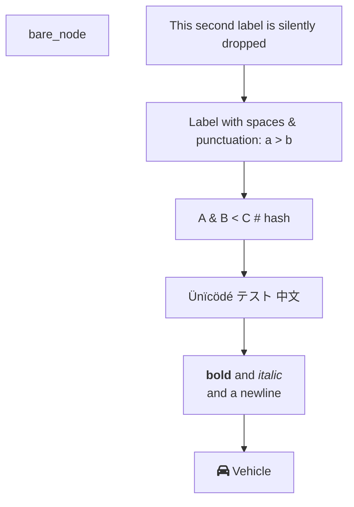

---

## F-04 · Edge / link types

Every arrow and line variant.

```mermaid
flowchart LR
    %% --- arrow heads ---
    A --> B          %% solid arrow
    C --- D          %% open link (no head)
    E --o F          %% circle head
    G --x H          %% cross head
    I <--> J         %% bidirectional arrow
    K <--o L         %% bidirectional circle
    M <--x N         %% bidirectional cross

    %% --- stroke styles ---
    P -.-> Q         %% dotted arrow
    R -.- S          %% dotted open
    T ==> U          %% thick arrow
    V === W          %% thick open

    %% --- inline label (two syntaxes) ---
    X -- label text --> Y
    X -->|pipe label| Z
    X -. dotted label .-> Z
    X == thick label ==> Z
```

---

## F-05 · Edge length (extra dashes)

More dashes / dots / equals = longer rank span.

```mermaid
flowchart TD
    A -->   B       %% length 1
    A --->  C       %% length 2
    A ----> D       %% length 3

    E -.->  F       %% dotted length 1
    E -..-> G       %% dotted length 2

    H ==>   I       %% thick length 1
    H ===>  J       %% thick length 2

    %% label in the middle: extra dashes go on the right side
    K -- mid label ---> L
```

---

## F-06 · Multi-target chaining

Multiple edges declared on one line.

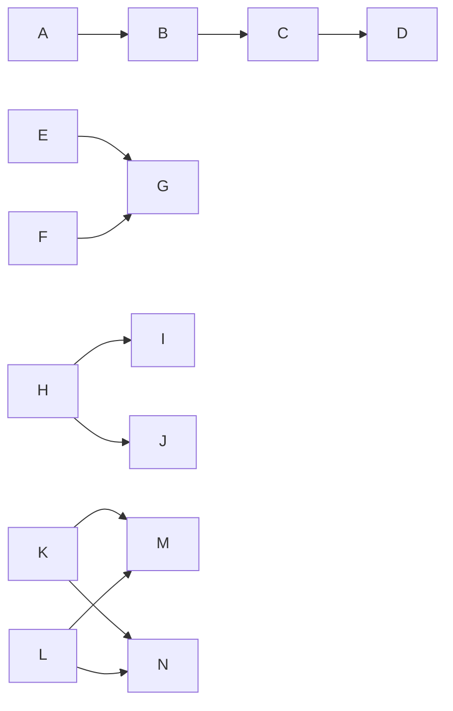

---

## F-07 · Subgraphs

Flat, nested, with explicit IDs, with per-subgraph direction, and
edges that cross subgraph boundaries.

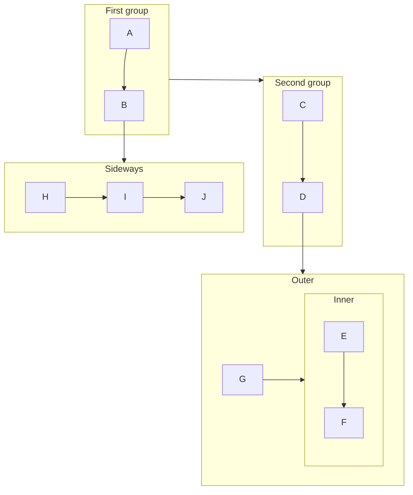

---

## F-08 · Styling — inline node styles

Per-node `style` overrides.

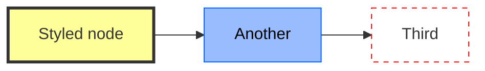

---

## F-09 · Styling — classDef and class assignment

Named class definitions and all three ways to attach them.

```mermaid
flowchart TD
    %% --- class definition ---
    classDef primary fill:#4a90d9,stroke:#2c6fa8,color:#fff,stroke-width:2px
    classDef danger  fill:#e74c3c,stroke:#c0392b,color:#fff
    classDef default fill:#eee,stroke:#999       %% applies to all unclassed nodes

    A[Start]:::primary --> B{Decision}:::primary
    B -->|yes| C[OK]:::primary
    B -->|no|  D[Fail]:::danger

    %% explicit class statement (single node)
    class C primary

    %% explicit class statement (multiple nodes at once)
    class D,B danger
```

---

## F-10 · Styling — linkStyle

Per-edge style by 0-based index, and multi-edge selector.

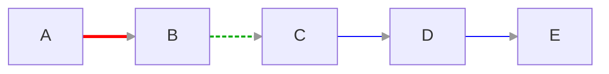

---

## F-11 · Click interactions

URL links, JS callbacks, and tooltips. (Requires securityLevel:'loose'.)

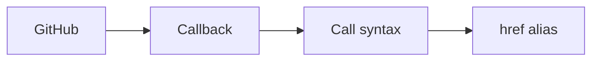

---

## F-12 · Front-matter config block

YAML front-matter that configures layout, look, theme, and curve.

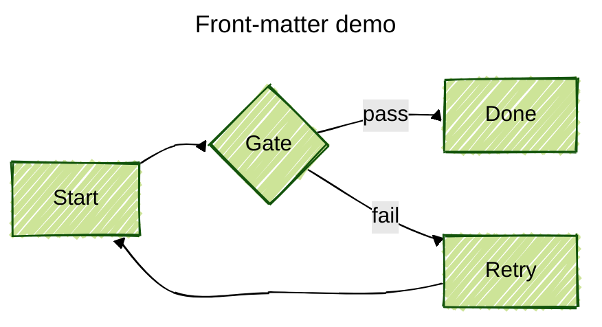

---

## F-13 · Init directive (legacy inline config)

The `%%{init: ...}%%` directive as an alternative to front-matter.

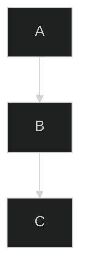

---

## F-14 · Comments

Comment lines (ignored by parser) in various positions.

```mermaid
flowchart LR
    %% This whole line is a comment
    A --> B  %% inline comment after a statement is NOT supported — this text is part of the line
    %% but a line starting with %% is always a comment
    B --> C
    %% Comments can appear between any statements
    C --> D
```

> Note: `%%` only starts a comment when it is the very first non-whitespace content on a line.
> Trailing `%%` after a statement is **not** a comment — it is a parse error or ignored
> depending on the version.

---

## F-15 · Edge IDs and animation (v11.10+)

Named edges, per-edge curve override, and animation properties.

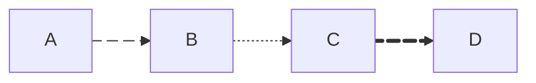

---

## F-16 · Special characters and entity escaping

Characters that would otherwise break the parser.

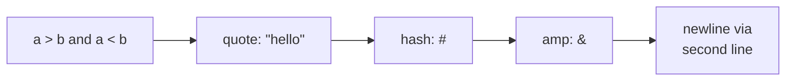

---

## F-17 · Invisible links (layout hints)

`~~~` forces extra space between nodes without drawing an edge.

```mermaid
flowchart LR
    A --> B
    A --> C
    B ~~~ C   %% invisible link pushes C further right for layout
```

---

## F-18 · Composite: real-world diagram using most features together

A single diagram that exercises the majority of constructs in combination.

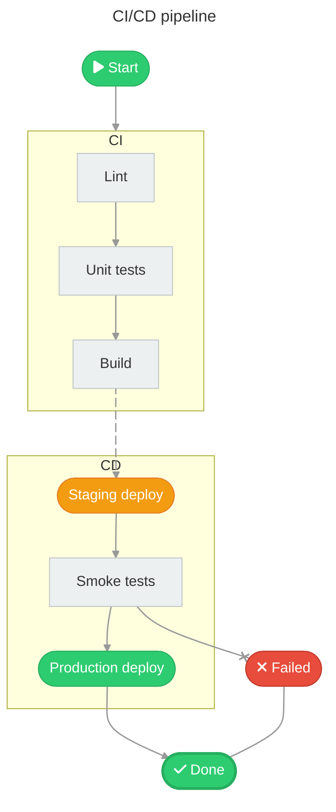

---

## Construct coverage checklist

| # | Construct | Fixture(s) |
|---|-----------|------------|
| 1 | `flowchart` keyword | F-01 |
| 2 | `graph` alias | F-01 |
| 3 | Directions: TB TD BT LR RL | F-01 |
| 4 | Bare node (id only) | F-03 |
| 5 | Node shapes — classic bracket syntax (14 shapes) | F-02 |
| 6 | Node shapes — `@{shape:}` syntax | F-02 |
| 7 | Plain text label | F-03 |
| 8 | Quoted label | F-03 |
| 9 | HTML entity in label (`#nn;` and `&name;`) | F-03, F-16 |
| 10 | Unicode in label | F-03 |
| 11 | Markdown string label (backtick) | F-03 |
| 12 | FontAwesome icon in label (`fa:`) | F-03, F-18 |
| 13 | Node id reuse (last text wins) | F-03 |
| 14 | Arrow edge `-->` | F-04 |
| 15 | Open edge `---` | F-04 |
| 16 | Circle head `--o` | F-04 |
| 17 | Cross head `--x` | F-04 |
| 18 | Bidirectional `<-->` `<--o` `<--x` | F-04 |
| 19 | Dotted `-.->` `-.-` | F-04 |
| 20 | Thick `==>` `===` | F-04 |
| 21 | Inline label `-- text -->` | F-04 |
| 22 | Pipe label `-->|text|` | F-04 |
| 23 | Edge length (extra dashes/dots/equals) | F-05 |
| 24 | Chain `A --> B --> C` | F-06 |
| 25 | Multi-target `&` syntax | F-06 |
| 26 | Subgraph (basic) | F-07 |
| 27 | Subgraph with explicit id | F-07 |
| 28 | Nested subgraphs | F-07 |
| 29 | Per-subgraph `direction` | F-07 |
| 30 | Edges to/from subgraph id | F-07 |
| 31 | `style` per-node override | F-08 |
| 32 | `classDef` definition | F-09 |
| 33 | `class` assignment (single + multi) | F-09 |
| 34 | `:::className` inline syntax | F-09 |
| 35 | `default` classDef | F-09 |
| 36 | `linkStyle` by index | F-10 |
| 37 | `linkStyle` multi-index | F-10 |
| 38 | `linkStyle default` | F-10 |
| 39 | `click` URL | F-11 |
| 40 | `click` callback | F-11 |
| 41 | `click call` syntax | F-11 |
| 42 | `click href` alias | F-11 |
| 43 | Link target (`_blank` `_self` etc.) | F-11 |
| 44 | Tooltip on click | F-11 |
| 45 | YAML front-matter block | F-12 |
| 46 | `%%{init:}%%` directive | F-13 |
| 47 | `%%` comment line | F-14 |
| 48 | Edge IDs `e1@-->` | F-15 |
| 49 | `@{ animate: }` on edge | F-15 |
| 50 | Per-edge curve `@{ curve: }` | F-15 |
| 51 | Special chars in quoted labels | F-16 |
| 52 | `<br/>` in label | F-16 |
| 53 | Invisible link `~~~` | F-17 |
| 54 | Combined real-world usage | F-18 |

---

# Warnings

F-14 (comments) has a subtle rule that's easy to get wrong: %% only opens a comment when it is the first non-whitespace characters on a line. Trailing %% after a valid statement is not a comment — it either causes a parse error or is silently consumed depending on the version. Don't implement trailing comment stripping.
F-06 (& chaining) is one of the trickiest constructs to parse because A & B --> C & D is syntactic sugar that expands to four separate edges. The & groups on both sides of the arrow need to be cross-producted.
F-03 (label reuse) — when the same node id appears multiple times, only the last label definition wins. This matters if you're building a node table: don't deduplicate by first-seen, deduplicate by last-seen.
F-15 (edge IDs and animation) is v11.10+ only, so if you're targeting an older mermaid version you can skip that fixture entirely.