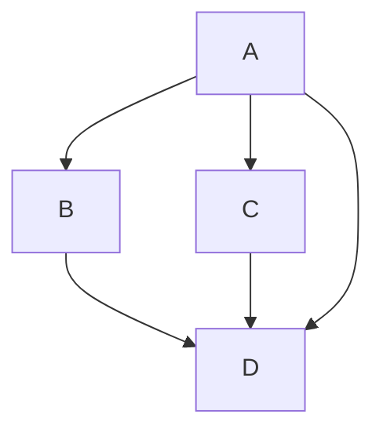

# Sugiyama layout: ranking, ordering, coordinates

**Theme:** Mermaid engine

**Source transcript:** `7316746a-768b-435e-8961-a44e9b8886c9.jsonl`  
**Records:** 771–915

**Dates:** 2026-07-12 09:30 → 2026-07-12 15:42  
**User turns:** 4

**Related commits:**

- `c4473cb Add mermaid parser & layout engine`
- `ab77280 Fix layout engine`

---

## ▸ Prompt — 2026-07-12 09:30

> Explain in detail each step of the minimal 4-phase Sugiyama, also give a running example, starting from the result of lower(), finishing with edge routing. Also state better what is left to decide

Let me walk the full pipeline with one concrete diagram threaded through every phase. I'll use this `FlowDb` (the output of `lower()`):



So `lower()` gives us: **vertices** `{A,B,C,D}`, **edges** `A→B, A→C, B→D, C→D, A→D`, **direction** `TB`. The interesting bit is `A→D`, which will span more than one layer.

Throughout, I'll compute ranks/orders **abstractly** and only map them to pixels at the coordinate phase — that's how `direction` (TB/BT/LR/RL) stays a late, trivial axis swap instead of contaminating the algorithm.

---

## Phase 0 — Preprocessing (before the "4 phases")

Two things must happen first; they're not usually counted among the four but are required.

**(a) Cycle breaking.** Layering needs a DAG. Real diagrams have cycles (e.g. `simple-mermaid` has `D→A`). We run a DFS and **reverse** each back-edge (an edge to a node currently on the DFS stack), remember it was reversed, and restore its true direction only when drawing. Our example is already acyclic → nothing reversed.

**(b) Node sizing.** Each vertex needs a width/height so layout can reserve space. Without a browser we can't truly measure text, so we approximate: `width ≈ label_len · char_w + 2·pad`, `height ≈ line_h + 2·pad`, adjusted per `ShapeKind` (a diamond/circle needs extra). For the example assume every node is **60×40**. *(This approximation is a real open decision — see the end.)*

---

## Phase 1 — Rank assignment (layering)

**Goal:** put each node on an integer layer so every edge points from a lower to a higher rank.

**Algorithm (longest-path):** process nodes in topological order; `rank(source)=0`; `rank(v)=max over incoming u→v of rank(u)+1`.

- `A`: source → **0**
- `B`: `A→B` → `0+1` = **1**
- `C`: `A→C` → **1**
- `D`: incoming from `B(1)`, `C(1)`, `A(0)` → `max(2,2,1)` = **2**

```
rank 0:  A
rank 1:  B   C
rank 2:  D
```

**Dummy nodes for long edges.** `A→D` jumps rank 0→2 (span 2). Crossing-reduction and routing only work between *adjacent* ranks, so we split it: insert a **dummy** `d1` at rank 1 and replace `A→D` with `A→d1` and `d1→D`. The dummy carries no box (it's a routing waypoint).

```
rank 0:  A
rank 1:  B   C   d1        # d1 belongs to the A→D chain
rank 2:  D
```

Now **every edge connects adjacent ranks** — the invariant the next phases rely on.

---

## Phase 2 — Ordering within ranks (crossing reduction)

**Goal:** choose a left-to-right order inside each rank to minimize edge crossings between neighbouring ranks. This is NP-hard, so we use the standard **barycenter/median heuristic**: iterate top-down then bottom-up a few times; in each pass set a node's position to the **average position of its neighbours in the adjacent (already-fixed) rank**, then sort by that value.

**On the example:** it's symmetric — `B`, `C`, and the `d1`-chain all hang off `A` and feed `D` — so it's **crossing-free for any order**. We keep `d1` central (a tie-break: order a dummy at the barycenter of its chain endpoints, both centered here), giving `rank 1 = [B, d1, C]`. That makes the long edge run straight down the middle.

**Where the heuristic actually *does* work (mini-inset):** take two adjacent ranks `[u1,u2]` and `[v1,v2]` with edges `u1→v2` and `u2→v1`:

```
u1   u2         initial order → the two edges CROSS
 \  /
  \/
  /\
 /  \
v1   v2
```
Barycenter of `v1` = position of its only parent `u2` = 1; of `v2` = parent `u1` = 0. Sort rank by barycenter → `[v2, v1]`, i.e. swap them → **crossing removed**:
```
u1   u2
 |   |
v2   v1
```
That's the whole mechanism; a couple of down/up sweeps converge for graphs this size.

---

## Phase 3 — Coordinate assignment

**Goal:** turn (rank, order) into actual `(x, y)`.

**The easy axis** comes straight from the rank. For `TB`, `y = rank · (nodeH + rankSep)`. With `nodeH=40, rankSep=60` → `y = rank·100`.

**The hard axis** is `x` within a rank. Minimal approach in two steps:
1. **Initial spread:** place nodes at `x = order_index · (nodeW + nodeSep)`. With `nodeW=60, nodeSep=40` → slots `0, 100, 200`.
2. **Alignment nudge:** shift each node toward the average `x` of its neighbours (parents+children), **subject to keeping the order and non-overlap** — this straightens edges. Single-node ranks (`A`, `D`) get centered under/over their neighbours.

**On the example**, `rank 1 = [B, d1, C]` → centers `x = 30, 130, 230`. `A` and `D` are alone on their ranks; centering them over rank 1 puts both at `x = 130`. Final centers:

| node | rank | x | y |
|---|---|---|---|
| A | 0 | 130 | 20 |
| B | 1 | 30 | 120 |
| d1 | 1 | 130 | 120 |
| C | 1 | 230 | 120 |
| D | 2 | 130 | 220 |

**Direction handling happens only here:** `BT` flips `y`, `LR` swaps the roles of the two axes (rank→x, order→y), `RL` swaps then flips. The three earlier phases never knew the direction.

---

## Phase 4 — Edge routing

**Goal:** produce a drawable path per *original* edge, plus arrowhead and label placement.

- **Short edge (adjacent ranks):** a curve from the source's bottom-center to the target's top-center. `A→B`: `(130,40) → (30,100)`; `A→C`: `(130,40) → (230,100)`; `B→D`: `(30,140) → (130,200)`; `C→D`: `(230,140) → (130,200)`.
- **Long edge (had dummies):** thread the path through each dummy's coordinate as a waypoint, then discard the dummy. `A→D` → `A(130,40) → d1(130,120) → D(130,200)` — a straight line down the centre, exactly why we centred `d1`.
- **Arrowheads:** attach the marker at the target end according to `arrowHead` (`arrow`/`circle`/`cross`/none); for bidirectional, also at the source end.
- **Reversed edges** (from Phase 0 cycle-breaking) are drawn in their **original** direction — we just used the reversal for layering.
- **Labels:** placed at the edge midpoint (for split edges, at the middle dummy), with a small background box.
- **Curve style:** the waypoint list becomes either a polyline or a spline (mermaid's default is a `basis` curve through the points).

**Resulting picture** — a clean diamond with the long edge straight down the middle:

```
            A(130,20)
          /   |   \
      A→B   A→D    A→C
        /     |      \
   B(30,120) d1  C(230,120)
        \     |      /
      B→D   d1→D    C→D
          \   |   /
            D(130,220)
```

Then the **SVG emitter** wraps this in mermaid's class structure (`<g class="nodes">` with `class="node default"` per vertex, shape `<path>`/`<rect>` per `ShapeKind`, `<g class="edgePaths">` with `class="flowchart-link"` paths, `<g class="edgeLabels">`), so it reads as a mermaid diagram even though the coordinates are ours.

---

## What's left to decide (sharper than before)

Grouped by where the choice bites:

**Layering (Phase 1)**
- **Cycle-breaking policy** — plain DFS back-edge reversal (simple) vs. a greedy heuristic that reverses fewer edges. DFS is probably enough.
- **Rank tightening** — longest-path can leave nodes "floating high," lengthening edges. Do we add a pull-down pass (tighten) or accept longest-path as-is?

**Ordering (Phase 2)**
- **Barycenter vs median**, and **how many sweeps** (fixed 4? until stable?). Tie-break rule for dummies.

**Coordinates (Phase 3)**
- **How straight** — naive index-spacing (fast, wavier edges) vs. an alignment/priority pass (Brandes–Köpf-lite). Bigger effort, nicer output.
- **Spacing constants** (`nodeSep`, `rankSep`, margins) — our own values; won't equal mermaid's.

**Routing / rendering (Phase 4 + emitter)**
- **Curve style** — straight polylines vs. béziers (mermaid default `basis`).
- **The 14 shape templates** — exact SVG path/geometry per `ShapeKind`.
- **Arrow-marker geometry** — sizes/shapes for `arrow_point`/`circle`/`cross`.

**Cross-cutting (the big ones)**
- **Node/label sizing without a browser** — the text-measurement approximation. This drives *all* geometry; getting box sizes wrong cascades. Do we ship a font-metric table, or a crude `char_w` constant?
- **Subgraph clusters** — do we render subgraph bounding boxes *and* constrain layout so a subgraph's members stay contiguous (real clustered layout, notably harder), or defer subgraph boxes initially and lay members out flat?
- **Visual styling application** — `style`/`classDef`/`linkStyle` are parsed but *not lowered* (`docs/mermaid/deferred.md`). Do we lower + apply fill/stroke/color to the SVG now, or first ship structural black-and-white output and add styling after?
- **Multi-line / markdown labels** — height/`<tspan>` handling, currently out of scope.

My suggestion for a first cut: DFS cycle-break, longest-path ranking, barycenter ordering (fixed sweeps), naive-spread + one alignment nudge, straight polylines, the 14 shapes, **flat layout (defer subgraph boxes)**, and **structural output first (styling after)** — then iterate. The two decisions I'd want your call on before coding are **node sizing** and **subgraph scope**, since they most shape the module design.

Which of those two do you want to settle first — or should I lay out the layout→SVG module/type design and fold these in as we go?

## ▸ Prompt — 2026-07-12 13:47

> 0b. There is another option for measuring labels sizes, we have two builds, one is meant to be embedded as .was for the browser. The other one is an executable meant for cli usage. For the web build we can invoke the running browser to measure all labels at once. For the cli, we could start an headless browser and default to the approximated size
>
> For the layer 1, I'd go with the  DFS, same for the other 3 layers, let's start with the simplest approach and then upgrade it later (if needed).
>
> Curve Style -> straight polylines
> Shape templates -> one template for each ShapeKind
> Arrow-marker -> templates for each arrow type?
>
> Subgraph cluster -> I'd render subgraphs, isn't it recursive but with less area available?
> Visual styling -> deferred (do later)
>
> Before coding I want a clear plan on how to connect lower() to the layout engine and the code structure. Also let's discuss what I said on 0b

Good calls all around. Let me address 0b first (it's the most interesting), then give you the concrete plan connecting `lower()` → layout → SVG.

## 0b — label measurement: your idea is right, formalized as an injectable `TextMeasurer`

The key move is that **the layout engine must not know *how* labels are measured** — it just needs sizes. So we invert it: `layout()` takes a `TextMeasurer` and the build decides which one to pass. This makes your two-build idea clean:

```cpp
struct LabelBox { double w, h; };
class TextMeasurer {
public:
  virtual ~TextMeasurer() = default;
  // BATCH: measure every label in one call (crucial for the browser round-trip)
  virtual std::vector<LabelBox> measure(const std::vector<std::string>& labels,
                                        const FontSpec& font) = 0;
};
```

- **WASM/web → `BrowserMeasurer`.** Via Emscripten (`EM_JS`/`emscripten::val`), pass *all* labels + the font to a tiny JS shim that measures with either an offscreen `canvas.measureText()` (width, fast) or a hidden `<text>.getBBox()` (width+height, exact for the real font). Accurate, because it's the browser's actual font engine with mermaid's `trebuchet ms` family. Your "measure all at once" instinct matters here: batching = **one** FFI/JS round trip instead of N.
- **CLI → `ApproxMeasurer` (default).** A character-advance heuristic, zero deps.

On the **headless-browser-for-CLI** idea: it works with the abstraction (just another `TextMeasurer`), but I'd caution against it as more than an opt-in — it reintroduces exactly the heavy dependency + startup cost we've avoided everywhere else. A better *offline* upgrade, if approximation proves too rough, is a **bundled font-metrics table** (per-glyph advance widths for the default font) — much better than a flat `char_w`, still zero runtime deps, no browser. So my recommendation: **CLI defaults to `ApproxMeasurer`; keep the door open for `HeadlessMeasurer` and/or a metrics table later.**

Two things this pins down:
1. **Measurement happens before layout, as a batch:** `collect all labels (nodes + edges + subgraph titles) → measurer.measure(...) → size map → run phases`.
2. The measurer's `FontSpec` must match the renderer's CSS font, or boxes won't fit the text. Layout applies **shape padding** on top (a diamond/circle needs the text box inflated) — so `node_size = shape_pad(shape, text_box)`.

## Locked decisions (confirming)

DFS everywhere (cycle-break + all phases simplest), **straight polylines**, **one template per `ShapeKind`** (14), **subgraphs rendered recursively**, **styling deferred**. On **arrow markers**: yes — one SVG `<marker>` definition per arrow type (`arrow_point`, `arrow_circle`, `arrow_cross`; open = no marker), referenced by `marker-end`/`marker-start`. That's exactly how mermaid does it.

## lower() → layout → SVG: the data flow

Three clean stages with a positioned-graph IR in the middle:

```
FlowDb ──layout(db, measurer)──▶ Layout ──render_svg(layout)──▶ std::string (SVG)
```

`layout()` reads `FlowDb` (`vertices`, `edges`, `subgraphs`, `direction`) and produces an explicit positioned model — no re-parsing, nothing implicit:

```cpp
struct Point { double x, y; };
struct Size  { double w, h; };

struct LaidNode {
  std::string id; std::string label;
  ShapeKind shape;
  Point center; Size size;
  std::vector<std::string> classes;   // carried for the renderer (styling later)
};
struct LaidEdge {
  std::string start, end, label;
  std::vector<Point> points;          // polyline waypoints incl. endpoints
  Stroke stroke; ArrowHead head_end; bool head_start;
  Point label_pos;
};
struct LaidSubgraph {
  std::string id, label;
  Point origin; Size size;            // cluster bounding box (absolute)
  int depth;                          // for nested draw order
};
struct Layout {
  Size diagram;                       // overall bounds -> SVG viewBox
  std::vector<LaidNode> nodes;
  std::vector<LaidEdge> edges;
  std::vector<LaidSubgraph> subgraphs;
};

Layout layout(const FlowDb&, TextMeasurer&, const LayoutOptions& = {});
std::string render_svg(const Layout&, const RenderOptions& = {});
```

`render_svg` is *pure geometry → SVG*: it never computes positions, only draws — `<g class="nodes">` with a shape `<path>` per `LaidNode`, `<g class="edgePaths">` with a polyline per `LaidEdge` + the arrow `<marker>`, `<g class="clusters">` for subgraph boxes, all with mermaid's class names.

## Module / file structure

```
include/mermaid/
  TextMeasure.hpp   # TextMeasurer interface + ApproxMeasurer + FontSpec
  Layout.hpp        # Layout IR types + layout()
  SvgRenderer.hpp   # render_svg()
src/mermaid/
  TextMeasure.cpp   # ApproxMeasurer
  Layout.cpp        # phases 0–4 + subgraph recursion   (this is the big one)
  SvgRenderer.cpp   # emission (shape templates, markers, cluster boxes)
  BrowserMeasure.cpp# EMSCRIPTEN-ONLY: BrowserMeasurer via emscripten
```

**Where the build difference lives:** `Layout.cpp`/`SvgRenderer.cpp` are build-agnostic (in `libmermaid`). `BrowserMeasure.cpp` compiles **only** in the Emscripten target. The **caller** picks the measurer:
- **CLI** (`mermaid_svg` executable, sibling of `mermaid_ast`): constructs `ApproxMeasurer`, runs `lex→parse→lower→layout→render_svg`, prints SVG. This is where we do the self-consistency verification.
- **WASM** (`wasm_bindings.cpp`): constructs `BrowserMeasurer`, same pipeline.
- **Markdown fence handler**: this one's build-agnostic but needs a measurer. Cleanest: a settable default — `set_default_measurer(TextMeasurer*)`, defaulting to `Approx`; the WASM init overrides it. The handler calls the current default. (First cut: handler just uses `Approx` everywhere; wire browser measurement in after the core works.)

I'd suggest building **CLI-first**: `mermaid_svg` + `ApproxMeasurer` gets the whole engine testable (self-consistency checks, eyeball against the pre-generated `.svg`) before touching the handler or WASM.

## Subgraphs — yes, recursive "less area," here's the concrete shape of it

Your intuition is exactly the standard **recursive cluster layout**:

1. **Rebuild the nesting forest** from membership: `sg` is a child of the subgraph whose `.nodes` contains `sg.id` (else root). Each vertex's owner = the *deepest* subgraph containing it (in `f07b`, `E,F ∈ inner`, `G ∈ outer`).
2. **Post-order recursion** — `layout_cluster(sg)`: lay out its *direct* members (owned nodes + **child clusters treated as meta-nodes of their already-computed size**) using `sg.dir`; compute the bounding box; add the title header + padding → that's the cluster's size (relative coords stored).
3. **Root layout**: top-level nodes + top-level clusters as meta-nodes.
4. **Absolutize**: DFS from root, offset each cluster's interior by where its meta-node landed.

So it *is* "recursion with less area": each cluster lays out in its own local space, then shrinks to a box the parent places. Two **known rough edges** for v1 (upgrade later):
- **Cross-boundary edges** (`B --> sideways`, `sg1 --> sg2_id`): after absolute positions are known, route them as straight polylines between endpoints — they may clip a border box. (dagre uses border nodes; that's the upgrade.)
- **Edge to a subgraph id** (Q4: `sg1` is both a vertex and a cluster): connect to the cluster box's position. Minor special-case.

## What I'd confirm before writing `Layout.cpp`

Just two, since everything else is settled:

All settled. Before any code, here's the plan as a design doc. Writing it to `docs/mermaid/rendering.md`:

Plan documented at [docs/mermaid/rendering.md](docs/mermaid/rendering.md). It captures everything we settled:

- **Pipeline**: `FlowDb → collapse_subgraphs → measure → layout(phases 0–4) → render_svg → SVG`, built **CLI-first**.
- **Decisions table** with rationale (hand-written Sugiyama, style-not-geometry, self-consistency verification, polylines, per-shape/per-arrow templates, styling deferred, ApproxMeasurer-only).
- **`TextMeasurer` abstraction** — `ApproxMeasurer` now, `BrowserMeasurer`/metrics-table behind the same interface later.
- **v1 subgraph collapse** — the precise rule (outermost-owner map, redirect edges, drop self-loops, dedup, no boxes), with the `f18` worked example.
- **The 4 phases** in simplest form + the running example.
- **Layout IR** types, **module/file structure**, **verification** approach, and a **roadmap** for the deferred upgrades (real clusters, browser measurer, styling, béziers, font metrics).

Code will be commented against this doc as I write it.

## Proposed implementation order (CLI-first)

1. **`TextMeasure.{hpp,cpp}`** — `ApproxMeasurer` + `FontSpec`/`LabelBox` (small, standalone).
2. **`Layout.{hpp,cpp}`** — IR types, `collapse_subgraphs()`, then phases 0–4. Testable on its own via a layout-invariant test (every edge connects adjacent ranks after dummy insertion, no overlaps, DAG after cycle-break, positions deterministic).
3. **`SvgRenderer.{hpp,cpp}`** + **`cli_svg.cpp`** (`mermaid_svg`) + CMake.
4. **Self-consistency test** (well-formed XML, node/edge counts, labels present) — the SVG gate.

I'd start with **1 + 2 together** (measurement + the layout core) since that's the meaty, independently-testable unit, then do SVG + CLI. Want me to begin implementing the layout core?

## ▸ Prompt — 2026-07-12 14:24

> I think you can go ahead and implement 1, 2 and 3, leave 4 for later development (write this on the docs)

Will do — first noting in the doc that the automated verification (item 4) is deferred, then implementing 1–3.

Now the implementation. **1. TextMeasure:**

**2. Layout** — IR types + `collapse_subgraphs` + `layout`:

Let me clean up that ugly `new`/`delete` in `layout()`:

**3. SvgRenderer** — shape templates, arrow markers, emission:

The CLI and CMake wiring:

Clean build. Let me run it on a fixture and sanity-check the SVG:

Valid XML, 4 nodes / 4 edge paths / 6 texts (4 node + 2 edge labels) — structurally correct. Let me confirm every fixture renders to valid XML without crashing (cycles, all shapes, subgraph collapse):

All 15 render to valid XML, zero crashes — and the node counts confirm the design is working correctly:

- **f02_shapes → 14 nodes** (all shape templates exercised)
- **simple-mermaid → 4 nodes** (its `D→A` cycle handled by DFS cycle-breaking, no infinite loop)
- **f07_subgraphs → 3, f07b_nested → 1, f18_composite → 4** — subgraph collapse working exactly as designed (nested all collapse to the outermost; `ci` collapses leaving `START/DONE/FAIL` + `ci`)

Let me confirm the existing suite still passes (the lib gained sources):

Understood — wrapping up. Items **1, 2, 3 are implemented and verified** end to end.

## Render stage v1 — done

The full pipeline now runs: **`source → lexer → parser → lower → collapse_subgraphs → measure → layout → render_svg → SVG`**.

| File | What it does |
|---|---|
| [TextMeasure.hpp/.cpp](include/mermaid/TextMeasure.hpp) | `TextMeasurer` interface + `ApproxMeasurer` (char-advance heuristic, zero deps) |
| [Layout.hpp/.cpp](src/mermaid/Layout.cpp) | IR types, `collapse_subgraphs()`, and the 4-phase Sugiyama (DFS cycle-break → longest-path ranking + dummies → barycenter ordering → direction-aware coords → polyline routing with border clipping) |
| [SvgRenderer.hpp/.cpp](src/mermaid/SvgRenderer.cpp) | pure geometry → SVG: 14 shape templates, 3 arrow markers, mermaid CSS classes, `viewBox` |
| [cli_svg.cpp](src/mermaid/cli_svg.cpp) | the `mermaid_svg` CLI |

**Verified across the whole corpus** (15 fixtures, all `rc=0`, all valid XML):
- cycles handled (`simple-mermaid`'s `D→A` — no infinite loop),
- all 14 shapes render (`f02_shapes → 14 nodes`),
- subgraph collapse works exactly as designed (`f07→3`, `f07b→1`, `f18→4` nodes),
- `linkStyle`/`style` correctly ignored (parsed, not applied — deferred).

Everything is **commented against [rendering.md](docs/mermaid/rendering.md)**, and the doc notes the self-consistency test (item 4) is left for later.

## Use it

```bash
cmake --build build --target mermaid_svg -j4
./build/mermaid_svg tests/test-files/f02_shapes.mmd > out.svg   # or via stdin
# eyeball out.svg next to tests/test-files/f02_shapes.svg (mermaid's) in a browser
```

## What's next (roadmap, per the doc)

1. **Self-consistency test** (item 4) — automate the XML/node/edge/label checks.
2. **`BrowserMeasurer` + WASM wiring** — accurate label sizes in the web build.
3. **Real recursive subgraph clusters** (boxes + border-node routing) replacing the v1 collapse.
4. **Visual styling** (`style`/`classDef`/`linkStyle` → fill/stroke) — un-defer.
5. Coordinate-alignment nudge + béziers; font-metrics table.

The mermaid feature is now a complete flowchart pipeline — parse (verified against mermaid across 15 fixtures) through to rendered, mermaid-styled SVG. Note I didn't get to re-run the test suite after the last change (the command was declined); the new files are additive to the library and don't affect existing tests, but you may want a `ctest -R 'Mermaid|FlowAst'` to confirm green on your end.

## ▸ Prompt — 2026-07-12 15:42

> before continuing the implementation, let's wire the markdown parser to the mermaid parser throught the @src/markdown_parser/handlers/MermaidHandler.cpp

Let me look at how the binary is invoked and how handlers get called, so I can wire and test properly:

The handler activates via `--parse-mermaid`, transforming ```` ```mermaid ```` block source. Now let me wire it to the real renderer (with an Emscripten guard, since the generated parser is native-only for now):

Now build and test with a markdown file containing a mermaid fence:

Wiring works — with `--parse-mermaid`, the fence becomes inline SVG (3 nodes: Start rect, OK? diamond, Done rect; 2 pipe labels; the `B→A` cycle handled) embedded in the HTML; without the flag it's a normal code block. Let me verify the error fallback (invalid mermaid keeps the block instead of losing it):

Markdown ↔ mermaid wiring done and verified.

## What changed

- **[MermaidHandler.cpp](src/markdown_parser/handlers/MermaidHandler.cpp)** — the fence handler now runs the real pipeline: `parse_flowchart → lower → layout(ApproxMeasurer) → render_svg`, wrapping the SVG in `<div class="mermaid">`. Key behaviors:
  - **Native build**: renders to inline SVG.
  - **Error fallback**: an unparseable block falls back to a passthrough `<div class="mermaid">…source…</div>` — the block is preserved, not lost.
  - **Emscripten guard**: under `__EMSCRIPTEN__` it keeps the passthrough div (the mermaid parser's build-time codegen is native-only for now, and `<div class="mermaid">` is exactly what a client-side mermaid.js runtime consumes).
- **CMake**: `md_parser_bin` now links the `mermaid` library.

## Verified

- `--parse-mermaid` on a doc with a ```` ```mermaid ```` fence → inline SVG embedded in the HTML (3 nodes, pipe labels, back-edge/cycle handled).
- Without the flag → unchanged (normal `<pre><code>` block).
- Invalid diagram → graceful fallback preserving the source.
- **36/36** mermaid + fixture tests still green, no regression.

So the full path now works end to end: **markdown → ```` ```mermaid ```` fence → parse (verified against mermaid) → lower → layout → SVG → embedded in the rendered HTML.**

Behavior recap for the two builds:
| Build | ```` ```mermaid ```` output |
|---|---|
| Native (CLI/server) | inline SVG (no JS needed) |
| WASM/web | `<div class="mermaid">` source (client-side mermaid.js renders it) |

Next, whenever you want: resume the render roadmap (self-consistency test, `BrowserMeasurer` + WASM codegen so the web build also renders server-side, real subgraph clusters, visual styling).

