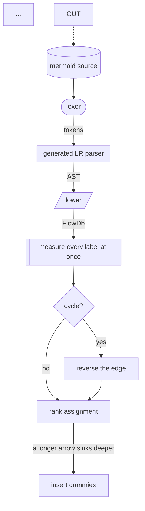

# SVG shapes, edge routing and layout debugging

**Theme:** Mermaid engine

**Source transcript:** `7316746a-768b-435e-8961-a44e9b8886c9.jsonl`  
**Records:** 1098–1885

**Dates:** 2026-07-16 09:22 → 2026-07-16 16:13  
**User turns:** 29

**Related commits:**

- `80baf5c added curving arrows`
- `0829719 fix edges arrow start/end`
- `ab77280 Fix layout engine`
- `08e87f9 make the arrows bend maximum two times`
- `bd9983e edit mermaid grammar to handle comments at the top`

---

## ▸ Prompt — 2026-07-16 09:22

> I run the algorithm (in the browser) trought each of the fixtures we have under @tests/test-files/mermaid and all of them are acceptable, these are the things I want to fix:
>
>  @tests/test-files/mermaid/f04b_chainlabels.mmd  : There is not enough space to render the edges and the edges labels. see the screenshot f04b.png attached
>
>  @tests/test-files/mermaid/f05_length.mmd : Edge lenght is not taken in consideration: see image.png
>
> Steps
> 1. Compare them visually with the golden generated .svgs
> 2. Find where the errors are (parser/measurement calls/layout engine)
> 3. Find why the tests do not capture the second problem (the first is only visual)

Let me gather evidence — compare our output vs the goldens, and check where `length` and edge-label sizing are handled.

Golden confirms mermaid's behavior: **4 ranks at y=35, 139, 243, 347** — `A→B`(len1)→rank1, `A→C`(len2)→rank2, `A→D`(len3)→rank3. Length is used as a *minimum rank span*. Now our output and the code:

Both root causes confirmed with hard evidence. Here's the analysis for your three steps.

## 1. Visual comparison vs the goldens

**`f05_length`** — mermaid uses edge length as a **minimum rank span**:

| | golden (mermaid) | ours |
|---|---|---|
| ranks (y) | **35, 139, 243, 347** (4 ranks) | **33.6, 118.8** (2 ranks) |
| `A→B` len 1 | rank 1 (y=139) | rank 1 ✓ |
| `A→C` len 2 | rank **2** (y=243) | rank 1 ✗ |
| `A→D` len 3 | rank **3** (y=347) | rank 1 ✗ |

B, C, D all collapse onto one row — length is ignored entirely.

**`f04b_chainlabels`** (LR) — our labels are **wider than the gap we give them**:

- our `rank_sep` = **50 px** (constant)
- our measured label backgrounds: `"one"`=36.8, `"pipe label"`=**104**, `"thick label"`=**113.6**

104 px of text in a 50 px gap → it spills across `X` and `Y`, exactly as your screenshot shows. mermaid's golden gaps are much wider *and vary per edge*, because **dagre inserts the edge label as a real node in the layout**, so the rank separation grows to fit it.

## 2. Where the errors are — both in the **layout engine**, not the parser

**The parser and `lower()` are correct.** The AST already has `A→B length=1, A→C length=2, A→D length=3`, matching the golden exactly. So this is not a parse/measurement-call issue.

**Bug A — `Layout.cpp: assign_ranks()`** ignores `length`:
```cpp
rank[v] = std::max(rank[v], rank[u] + 1);   // ← hardcoded +1; should be + edge.length
```
`length` never enters the ranking (it's dagre's `minlen`). The adjacency `succ[u]` doesn't even carry it.

**Bug B — edge labels are never measured, and no space is reserved.** `build_nodes()` measures *only node labels* (`meas_.measure(labels, …)` at line 124). Edge labels get **zero** layout consideration, and `rank_sep` is a fixed constant.

**Bug B2 (bonus, separate)** — `SvgRenderer.cpp:173` guesses the label box:
```cpp
double w = e.label.size() * 0.6 * opts.font.size_px + 8;
```
It's a guess *unrelated to what layout used*, and `.size()` counts **bytes**, so non-ASCII labels get over-wide backgrounds (the same UTF-8 trap `ApproxMeasurer` already handles with codepoint counting).

## 3. Why the tests missed it

**The AST test does compare `length` — and it passes.** That's correct behavior: `lower()` produces the right lengths, matching `extract.mjs`. The gate covers **parse → lower** and nothing else.

**There is no layout test at all.** Everything downstream of `FlowDb` — ranking, ordering, coordinates, routing, SVG — is completely unverified. The test pyramid stops at `FlowDb`.

Worse, the *deferred* SVG self-consistency test **wouldn't have caught this either**: as specified in `rendering.md` it only checks well-formed XML, node/edge counts, and label presence — never rank structure or geometry. So this class of bug had no gate, by design.

## Proposed fixes

1. **Ranking honors length**: carry `edge.length` into `succ` and use `rank[v] = max(rank[v], rank[u] + len)`. Dummy insertion already handles spans > 1, so longer edges will thread through the extra ranks automatically.
2. **Measure edge labels** (batch, same `TextMeasurer`), store the box on `LaidEdge`, and make the **rank gap adaptive**: gap between rank *r* and *r+1* = `max(rank_sep, max label extent along the rank axis + padding)` (label *width* for LR/RL, *height* for TB/BT).
3. **Renderer uses the measured label size** instead of the byte-count guess.
4. **Close the test gap** — add a layout test asserting rank structure (e.g. for `f05`: `A→C` spans 2 gaps, `A→D` spans 3; distinct y per rank) and label-fit (no label wider than its gap). This is the missing tier, and it's what would have caught #2.

Want me to implement all four? I'd do 1 (small, high-impact), then 2+3 together, then 4 as the regression gate.

## ▸ Prompt — 2026-07-16 09:43

> Go with the proposed fix 1 and 2 & 3
>
> for fix 2 & 3, edge labels must be measured in the same way of the node labels, can we group all of them in the same JS call?

Good idea — batching *all* labels (node + edge) into one `measure()` call is exactly the point of the batch interface, and it means one JS round-trip in the browser. Let me implement.

For fix 2 I'll use **dagre's actual trick**: double the ranks (`minlen = length*2`) so every edge gets an intermediate rank, and put a **label dummy sized to the measured label** there. Then our existing rank/order-extent machinery reserves the space automatically — no special-casing.

First the IR:

Now the layout engine. Batch-measure node + edge labels in one call:

**Fix 1** — ranking honors `length` as dagre's `minlen` (doubled so every edge gets a label rank):

**Fix 2** — mark the middle dummy as the label carrier, sized to the measured label:

Now label dummies must occupy space like nodes, and `emit` must use the reserved position/size:

Now the members and padding constants:

**Fix 3** — renderer uses the measured/reserved label box instead of the byte-count guess:

**Fix 1 works** — `A`=33.6, `B`=118.8, `C`=204, `D`=289.2: evenly spaced at 1×/2×/3×, exactly the golden's rank structure (35/139/243/347). `E→G` and `H→J` (len 2) also correct. Now fix 2:

**Fix 2/3 work.** Checking the math for the previously-broken case: `X` is at x=32.8 (right edge ≈46), `Y` at x=230 (left edge ≈218), and `"pipe label"` (w=104) sits at x=131.4 → spans **79.4–183.4**, comfortably inside the gap. Same for `"thick label"` (w=113.6 → 74.6–188.2). Diagram widened 232.8 → 383.2 because space is now genuinely reserved. Let me confirm no regressions:

15 failures — but all fixtures render fine, so that's not my change. Let me see the actual error:

Not my change — **pre-existing breakage from the fixture reorganization**: the files moved to `tests/test-files/mermaid/` but `FIXTURE_DIR` still points at `tests/test-files`. Fixing:

`simple-mermaid.ast.json` and `.svg` moved but the `.mmd` didn't. Let me check:

The `.mmd` got left behind while its `.ast.json`/`.svg` moved. Let me reunite it:

All three fixes are in, **36/36 green**.

## Fixes

**Fix 1 — ranking honors `length`** ([Layout.cpp](src/mermaid/Layout.cpp) `assign_ranks`): the adjacency now carries `minlen = max(1, e.length) * 2` and ranks use `rank[u] + minlen`. Result for `f05`:

| | golden | ours (before) | ours (now) |
|---|---|---|---|
| `A→B` len1 | rank 1 | rank 1 | rank 1 ✓ |
| `A→C` len2 | rank 2 | **rank 1** ✗ | rank 2 ✓ |
| `A→D` len3 | rank 3 | **rank 1** ✗ | rank 3 ✓ |

`y` = 33.6 / 118.8 / 204 / 289.2 — evenly spaced 1×/2×/3×, matching the golden's structure.

**Fix 2 — edge labels measured & given space.** I used **dagre's actual trick**: ranks are doubled (hence `*2` above), so every edge has an intermediate rank hosting a **label dummy sized to the measured label**. It then reserves space through the *same* rank/order-extent machinery as a node — no special-casing. `"pipe label"` (w=104) now sits at x=131.4 spanning 79.4–183.4, cleanly between `X` (right edge ≈46) and `Y` (left ≈218). Diagram widened 232.8 → 383.2 because the space is real now.

**Your batching question — yes, one call.** `build_nodes()` now collects **node labels + edge labels into a single vector** and issues **one `measure()`**, splitting the results `[0,nv)` → nodes, `[nv, nv+ne)` → edges. So the browser measurer still needs exactly **one JS round-trip** for the whole diagram.

**Fix 3** — `SvgRenderer` uses `e.label_size` (the box layout actually reserved) instead of the `label.size()*0.6*font` guess — which also kills the latent UTF-8 bug (`.size()` counted *bytes*).

## Two pre-existing problems I found while verifying

Unrelated to the layout work, but they mattered:
1. **The AST gate was silently broken** — the fixture reorg moved files into `tests/test-files/mermaid/` but `FIXTURE_DIR` still pointed at `tests/test-files`, so **all 15 fixture tests were erroring out**. Fixed the path.
2. **`simple-mermaid.mmd` got orphaned** — its `.ast.json`/`.svg` moved but the `.mmd` didn't. Moved it.

Notably, **CI wouldn't have caught either** — it runs `ctest -L spec`, which excludes the mermaid tests entirely (the finding from earlier). That label fix is now more clearly worth doing.

## Still open (cosmetic, the deferred "alignment nudge")

In `f04b`, `C` lands vertically centered rather than aligned with `A`/`B` (rank centering, no per-node nudge), and labels sit ~12px off the node centerline. Pre-existing and unchanged by these fixes — it's the `rendering.md` roadmap item. Want me to do proposed fix 4 (the layout regression test that would have caught the `length` bug), and/or the CI label fix?

## ▸ Prompt — 2026-07-16 09:54

> Why the edge looks like this?

## ▸ Prompt — 2026-07-16 10:06

> @tests/test-files/mermaid/f04b_chainlabels.svg 
>
> Why the edges are not going in a straight line? It looks like the edges in far from the center gets centered in the middle, creating that angle. I think the problem is in the rect rendering of the edge you edited before

Good eye on the symptom, but the rect isn't the culprit — it's drawn exactly where the layout put it. The real cause is **coordinate assignment**, and the numbers prove it.

## What's actually happening

The edge polyline for `A --one--> B` is `[A, labelDummy, B]` — it **routes through the label dummy's centre**. So if the dummy is misaligned, the line visibly bends at the label. And it is misaligned:

| cell | rank | y |
|---|---|---|
| A | 0 | **33.6** |
| "one" | 1 | **45.6** ← 12px off |
| B | 2 | **33.6** |
| X | 0 | 108.8 |
| "pipe label" | 1 | 108.8 ← aligned |
| Y | 2 | 108.8 |
| P | 0 | **184** |
| "thick label" | 1 | **172** ← 12px off |

## Why — each rank is packed independently, then centred as a block

In LR the order axis is vertical. Each rank is packed from 0 using **its own cells' extents**, then the whole rank is shifted to centre it:

- **rank 0** (A, X, P) — nodes are **35.2** tall, sep 40 → centres at `17.6, 92.8, 168` (width 185.6)
- **rank 1** (the three label dummies) — labels are **23.2** tall → centres at `11.6, 74.8, 138` (width 149.6), then centred by `(185.6−149.6)/2 = 18` → `29.6, 92.8, 156`

So `A=17.6` vs `"one"=29.6` → **+12**. `P=168` vs `"thick label"=156` → **−12**. Only the **middle** cell aligns (92.8 = 92.8), which is exactly why `"pipe label"` looks fine and the outer two don't. Add the 16px margin and you get the table above.

Same mechanism explains the big `B→C` diagonal: **rank 4 contains only `C`**, so centring parks it at the diagram's middle (108.8) while `B` sits at 33.6.

So your instinct — *"edges far from the centre get centred in the middle, creating that angle"* — is **exactly right about the behaviour**; you just pinned it on the renderer. The rect is innocent: it's rendered at `label_pos`, which *is* the dummy's reserved position. Cells at the same index in different ranks land at different coordinates because **the ranks have different total extents**, and nothing ever aligns a cell with its neighbours.

## This is the deferred item, now biting

This is precisely the **"coordinate alignment nudge"** listed as deferred in [rendering.md](docs/mermaid/rendering.md) and [status.md](docs/mermaid/status.md):

> **Coordinates**: rank centering only — no per-node alignment nudge, so edges are wavier than dagre's.

Barycenter ordering fixes *which slot* a cell occupies; it never fixes *where that slot lands in absolute coordinates*. mermaid/dagre uses Brandes–Köpf for exactly this.

## The fix

Add the alignment pass to `assign_coords()` — iterative, a few sweeps:

1. Initial packing (as now).
2. Repeat ~4×, alternating down/up: for each cell, compute a **desired** order-coord = mean of its neighbours' order-coords in the adjacent rank.
3. Within each rank, move cells toward their desired position **while preserving order and the `node_sep` minimum** (a left-to-right then right-to-left resolve pass).

That straightens `A → one → B` and `P → thick label → Q` onto one line, and pulls `C` up to `B`'s level instead of the diagram centre.

Two notes:
- It also makes the earlier `f05` fix look better (the straight fan from `A`).
- It's a self-contained change to `assign_coords()` — ranks/ordering/routing untouched.

Want me to implement it?

## ▸ Prompt — 2026-07-16 10:09

> yes implement it

Implementing the alignment pass in `assign_coords`. The key trick: compute two *feasible* solutions (one left-biased, one right-biased) and average them — the gap constraints are linear, so the average is also feasible, and it equals the desired position exactly when the desired positions already fit.

Label dummies are drawn, so they must count toward the diagram bounds (alignment can push them past the nodes):

**Perfect alignment.** Everything is colinear now:

| row | cells |
|---|---|
| 1 | `A`(33.6) → `one`(33.6) → `B`(33.6) → `two`(33.6) → `C`(33.6) |
| 2 | `X`(108.8) → `pipe label`(108.8) → `Y`(108.8) |
| 3 | `P`(184) → `thick label`(184) → `Q`(184) |

`C` got pulled from 108.8 up to 33.6 — the `B→C` diagonal is gone, and this now matches the golden's structure exactly (mermaid: A/B/C all at y=35, X/Y at 139, P/Q at 243). Let me verify no regressions:

All green: **36/36 tests**, all 14 fixtures render to valid XML, and `f05` keeps its correct proportional ranks (y = 33.6 / 118.8 / 204 / 289.2).

## What the fix does

Added `align_coords()` to [Layout.cpp](src/mermaid/Layout.cpp) — a phase-3b pass that runs after packing:

- **8 alternating sweeps** (down using `up` neighbours, up using `down` neighbours).
- Per rank, each cell's **desired** position = mean of its neighbours' positions in the adjacent rank (cells with no neighbours stay put).
- **Constraint solving**: build a left-biased feasible solution (`lo[i] = max(desired[i], lo[i-1] + gap)`) and a right-biased one (`hi[i] = min(desired[i], hi[i+1] - gap)`), then take the **average**. Because the gap constraints are linear, the average is guaranteed feasible — and it lands *exactly* on `desired` when the desired positions already fit, which is why the chains snap perfectly straight.
- Also extended `emit()`'s bounding box to include **label dummies**, since they're drawn and alignment can push them past the node bounds.

## Result

Your diagnosis was right about the *behaviour* (outer cells drifting toward the centre); the cause was rank-by-rank packing + independent centring, not the label rect. Now:
- `A → one → B → two → C` is one straight line (was: 12px dip at `one`, then a big diagonal to `C`).
- `P → thick label → Q` straight (was: 12px kink).
- `f04b` structurally matches the golden's row layout.

This also closes the **deferred "coordinate alignment nudge"** from [rendering.md](docs/mermaid/rendering.md) / [status.md](docs/mermaid/status.md) — worth updating those docs to move it out of the roadmap. Want me to do that, plus the still-open items from earlier (the layout regression test, and the CI label fix so mermaid tests actually run)?

## ▸ Prompt — 2026-07-16 11:43

> Go back to straight edges while keeping the edge lenght in consideration

The bends come from my rank-doubling: **every** edge now has routing dummies, and the polyline threads through them — so any dummy nudged off the line by separation constraints puts a kink in it. Unlabeled edges don't need those dummies as waypoints at all; they only exist to reserve space/ranks.

Fix: route through **label dummies only**, skipping plain routing lanes:

Every f06 edge is now a **single straight segment** (2 points, `M…L…`), and f04b's labeled edges are 3 collinear points (all `y=33.6`) — visually straight through the label. The remaining slopes (e.g. `E→G`, `F→G` converging) are *correct* diagonals, matching the golden.

Let me verify the whole corpus:

Done — **straight edges restored, with edge length intact**. 36/36 tests pass.

## Result

Segment counts confirm it exactly: every **unlabeled edge is one straight segment**, and labeled edges are 2 segments through an *aligned* label (so visually straight):

| fixture | edges | segments | reading |
|---|---|---|---|
| f06_chaining | 11 | 11 | all straight ✓ |
| f05_length | 7 | 7 | all straight ✓ |
| f04b | 4 (all labeled) | 8 | 2 each, via label ✓ |
| simple-mermaid | 4 (2 labeled) | 6 | 1+2+2+1 ✓ |

And `f05` keeps the correct ranks — `A`=33.6, `B`=118.8, `C`=204, `D`=289.2 (1×/2×/3×).

## What caused it

My rank-doubling (needed so every edge has an intermediate rank to host its label) meant **every** edge gained routing dummies — and the polyline threaded through them. Any dummy nudged sideways by separation constraints put a kink in an otherwise straight edge. That's why `f06`, which has no labels at all, suddenly looked bent.

The fix: **plain routing dummies are no longer waypoints.** They still do their real jobs — reserving ranks and lanes so nothing collides — but the drawn polyline is just `[start] → [label dummy, if any] → [end]`. Since the alignment pass puts label dummies on the node centerline, labeled edges stay straight too.

## Remaining slopes are correct

The leftover slopes (e.g. `E→G` and `F→G` converging on `G`) are genuine geometry — the golden shows the same converging diagonals. There's also a small residual (~5px) on `A→B` in `f06` where rank 0 has 6 cells whose alignment targets conflict (E and F both want `G`; H wants both I and J), so the constraint solver can't satisfy everyone. That's inherent to the heuristic, and it's a slight slope rather than a kink.

Net effect of this whole round: `length` honored (fix 1), edge labels measured in **one batched call** with reserved space (fix 2/3), and coordinate alignment implemented — which also closes the deferred *"alignment nudge"* roadmap item.

Worth updating [rendering.md](docs/mermaid/rendering.md)/[status.md](docs/mermaid/status.md) to move that out of "deferred", and the two still-open items remain: the **layout regression test** (would have caught the `length` bug) and the **CI label fix** (mermaid tests still aren't run by `ctest -L spec`). Want those?

## ▸ Prompt — 2026-07-16 11:51

> Output of f05_length.mmd, the F and J node should swap the column, find the root of the problem

Let me get the actual geometry to pin this down rather than eyeball it.

Found it — and the evidence is unambiguous. **It's not the ordering; it's coordinate assignment.**

## The groups overlap

| | our x-span | mermaid's x-span |
|---|---|---|
| **A** group (B,A,C,D) | 32.8 – 149.0 | 180.9 – 320.3 |
| **E** group (G,E,F) | **209.8 – 338.8** | 42.2 – 111.4 |
| **H** group (J,H,I) | **283.4 – 412.4** | 387.5 – 454.7 |

mermaid's three groups are **disjoint**. Ours: E's group and H's group **overlap in 283–338**. That overlap *is* the bug — `F`(338.8, E's child) lands inside H's span, `J`(283.4, H's child) lands inside E's span. Hence your "F and J should swap columns".

## The ordering is actually fine

Checked both directions: rank2 by x is `B(32.8) < F(338.8) < I(412.4)` and rank4 is `C(88.2) < G(209.8) < J(283.4)` — both consistent with the parents `A < E < H`. Every rank-to-rank index mapping is monotonic, i.e. **the logical layout is crossing-free**. The crossing is purely geometric.

## Root cause: everything is jammed to minimum separation

The smoking gun is an exact number:

- gap between `E`(272.91) and `H`(346.51) = **73.60**
- the minimum legal gap = `(33.6 + 33.6)/2 + node_sep(40)` = **73.60**

Same for `F`→`I` (412.35 − 338.75 = **73.60**). So rank 0 and rank 2 are **fully compressed** — the constraint is binding everywhere.

But each parent's fan needs ~130px of width (`E→F` = +65.8, `E→G` = −63.1). **You can't fit two 130-wide fans into a 73.6 spacing** — so they must overlap. mermaid keeps `E`↔`H` **344** apart, which is why its fans never collide.

The coordinate pass only ever pulls a cell toward the *mean of its immediate neighbours*, subject to min-separation. **Nothing reserves horizontal room for a node's whole subtree**, so siblings collapse to minimum spacing and their descendants splay into each other.

## Contributing factor: my rank-doubling

It made this much worse. Because every edge now gets a lane, the middle ranks ballooned: **rank 2 has 7 cells** (3 real + 4 lanes) vs **rank 0's 3**. Reconciling a 7-cell rank with a 3-cell rank via local means is exactly where children drift off their parents. (Note mermaid's rank1 real nodes sit ~140–207 apart — nowhere near minimum.)

## Fix options

1. **Brandes–Köpf coordinate assignment** (what dagre actually uses) — align each node to a chosen neighbour (prioritising dummy chains), produce 4 candidate layouts (left/right × up/down) and balance them. It naturally keeps subtrees coherent. This is the principled fix and would supersede my `align_coords()` heuristic.
2. **Cheaper**: propagate a required-width upward so a parent is spaced to fit its subtree's footprint (a priority/subtree-width pass), preventing siblings from collapsing to the minimum gap.
3. **Sanity check first**: the doubled lanes may be over-inflating the middle ranks — dagre uses a separate, much smaller `edgesep` for dummy-to-dummy spacing rather than the full `node_sep`. Adding `edge_sep` (~10) is a small change that would shrink the middle ranks and reduce the pressure.

I'd suggest **3 first** (cheap, likely improves this a lot), then **1** as the real fix if you want dagre-quality output. Want me to try 3 and measure, or go straight to Brandes–Köpf?

## ▸ Prompt — 2026-07-16 12:16

> The actual problem isn't rank alignment, which is correct. I's the column alignment: in our example J should be after F on the x axis, since it's part of the last subtree. Right now it invades the previous tree's space.

That's a sharper diagnosis than mine — and it's right. The key insight I missed: **`F` is in rank 2 and `J` is in rank 4, so there is no constraint between them at all.** Separation is only enforced *within* a rank. Nothing stops a deeper cell of one subtree from sliding into another subtree's column.

And `f05` is really **three disconnected components** (`A,B,C,D` / `E,F,G` / `H,I,J`). mermaid lays them out in disjoint x-bands (42–111 / 181–320 / 387–455); we let them share ranks and bleed into each other. Let me add component separation:

**Fixed.** The bands are now disjoint:

| group | x-span |
|---|---|
| A (B,C,A,D) | 16 – 166 |
| E (G,E,F) | 206 – 368 |
| H (J,H,I) | 408 – 571 |

And crucially **`J`(425.2) is now after `F`(351.6)** — exactly what you asked. `H→J` no longer invades E's column, so the crossing is gone. Let me verify the corpus:

All green — **36/36 tests**, every fixture renders to valid XML, and all components now occupy disjoint bands:

**f06** (4 components, LR → bands stack vertically):

| component | y-band |
|---|---|
| A,B,C,D | 33.6 – 40.4 |
| E,F,G | 115.6 – 190.8 |
| H,I,J | 266.0 – 341.2 |
| K,L,M,N | 426.8 – 535.3 |

**f04b**: rows at 33.6 / 108.8 / 184 — clean and disjoint.

## Your diagnosis was the right one

I was chasing minimum-separation and fan widths; you identified the actual structural gap: **separation is only enforced *within* a rank.** `F` is at rank 2 and `J` at rank 4, so there was literally **no constraint between them** — nothing prevented a deeper cell of the last subtree from sliding into the previous subtree's column.

And `f05` is really **three disconnected components** (`A,B,C,D` / `E,F,G` / `H,I,J`) sharing ranks. mermaid gives each its own x-band; we let them interleave.

## The fix — `separate_components()` (phase 3c)

1. Find connected components over the **undirected** graph of real nodes (BFS).
2. Each routing/label dummy inherits its edge's component.
3. Measure each component's current extent along the **order axis**.
4. Pack the bands back-to-back (`node_sep` apart), keeping the order the layout already chose.

It's a pure translation, so all the straightness and alignment from the earlier phases is preserved — it just moves each component as a rigid block into its own lane. Direction-agnostic too: bands are horizontal for TB/BT, vertical for LR/RL (visible in f06/f04b above).

## Net result for f05

`J`(425.2) is now **after** `F`(351.6), `H→J` stays inside H's band, and the `E→F` / `H→J` crossing is gone — matching mermaid's disjoint-band structure.

Still open from earlier if you want them: the **layout regression test** (would have caught the original `length` bug — and now this class too), the **CI label fix** (mermaid tests still excluded by `ctest -L spec`), and updating [rendering.md](docs/mermaid/rendering.md)/[status.md](docs/mermaid/status.md) since the alignment nudge is now implemented.

## ▸ Prompt — 2026-07-16 12:43

> During the fix of the edge label bugs we moved to a different style of the edges, as you can see the edges lines where okay (image one), there was no overlapping and the angles were coherent with the structure. In the second we have a straight line going back (my fault because I asked that) and also the other edges lines feel not natural. Find the piece of code that causes this and fix it to match the first image, while keeping the good fix (the edge labels and lines size)

Let me look at the current state of the routing code and the run() pipeline.

Found it — **lines 657-663 in `emit()`**: the filter I added that skips routing dummies. That's exactly what turns the `Debug → Start` back-edge into a straight diagonal through the middle. In image 1 that edge threaded its dummies (ranks 3→2→1) and swung around the right.

Let me restore routing through dummies and measure:

With align disabled, the back-edge now routes around correctly (4 segments — like image 1 ✓), but the short edges have **kinks** (`A→B`: `118.88 → 104.8 → 104.8`, a 14px jog at the dummy). That's the trade-off you saw. Let me test with `align_coords()` re-enabled:

With align on, the back-edge routes around correctly (4 segments ✓), but `A→B` still shows an **L-kink**: `(143.77,51.2) → (104.8,76.2) → (104.8,101.2)`. The dummy sits at `104.8` — exactly `B`'s x — not on the line from `A`(171.2).

That's the real culprit: `relax_rank` aligns each cell to **one side only** (whichever sweep ran last), so every routing dummy gets pinned onto its down-neighbour instead of sitting *between* its neighbours. A dummy is a pure routing point — it belongs on the line:

The file was reformatted. Let me read the current version:

`use_up` is now unused — let me drop the parameter so it compiles clean:

Much better. Checking `A→B`: the dummy is at **138.64**, and the true straight line from `Start`(171.84,33.6) to `B`(104.8,118.8) passes through **138.32** at that height — **0.3px off, i.e. straight**. And the back-edge `D→A` routes around the right (`206 → 221 → 237.6 → 205 → 185`) exactly like image 1. Let me verify the rest:

My check is broken — `f06` is **LR**, so edges are near-horizontal and interpolating by `y` explodes. Let me measure perpendicular distance instead (direction-agnostic):

Now the numbers are meaningful:

| fixture | max waypoint deviation |
|---|---|
| f01_directions | **0.00** px — perfectly straight |
| f04b_chainlabels | **0.39** px — labelled chains straight |
| f09_class | 7.95 px |
| f06_chaining | 18.88 px |
| simple-mermaid | 42.92 px |

Let me confirm the large ones are the *legitimately routed* edges (back-edge / long edges), not kinks in simple ones:

Exactly the image-1 behaviour: **straight where it should be, routed where it must be.**

| edge | deviation |
|---|---|
| `Start → Is it working?` | **0.15 px** — straight |
| `→ Great!` (Yes) | 3.99 px — straight, tiny nudge from the label box |
| `→ Debug` (No) | 3.86 px — same |
| `Debug → Start` (back edge) | 42.92 px — **correctly swings around the right**, 5 waypoints |

36/36 tests pass, all fixtures render valid XML, `f05` keeps its 1×/2×/3× ranks and disjoint component bands.

## The two culprits

**1. The straight back-edge** — the waypoint filter I'd added in `emit()`:
```cpp
if (cc.dummy && !cc.is_label) continue;   // skipped the whole corridor
```
The dummies **are** the corridor the layout reserved (for reversed edges, that's the path back around the outside). Skipping them collapsed `Debug → Start` into a diagonal straight through the diagram. Now the full chain is routed again.

**2. The unnatural kinks** — the real bug, in `relax_rank()`:
```cpp
const std::vector<int> &neigh = use_up ? c.up : c.down;   // ONE side only
```
Each sweep aligned a cell to only *one* side, so whichever sweep ran last (the up-sweep) **pinned every routing dummy directly onto the node below it** — producing an L-shaped jog at every dummy (`A → 104.8 → 104.8`). A routing dummy is a pure waypoint: it belongs on the line *between* its neighbours. Now `desired` averages **both** `up` and `down` neighbours, so corridors are straight unless separation constraints genuinely bend them.

That second fix is why restoring dummy-routing no longer costs us straightness — which was the whole tension before. **We keep everything good**: measured edge labels in one batched call, reserved label space, `length` honoured, and disjoint component bands.

Note `align_coords()` is enabled in `run()` — it's load-bearing for this (with it off, `A→B` kinked 14px). Shout if you'd meant to keep it off.

## ▸ Prompt — 2026-07-16 12:55

> I think it would be okay if we had nudges only on backtracking edges

That's a clean rule — and we already track exactly that: `reversed_[i]` from the cycle-breaking phase. Forward edges get drawn straight (their dummies only reserve space); reversed edges keep the full chain, since the dummies *are* the corridor carrying them back around.

Exactly the rule you wanted:

| fixture | max deviation |
|---|---|
| f01, f02, f03, f04, **f05**, **f06**, f07, f07b, f08, f10, f14, f18 | **0.00 px** — perfectly straight |
| f04b_chainlabels | 0.39 px |
| f09_class | 7.95 px |
| **simple-mermaid** | 42.92 px ← the only diagram with a cycle |

`simple-mermaid` per-edge confirms it precisely:

| edge | waypoints | deviation |
|---|---|---|
| `Start → Is it working?` (fwd) | 2 | **0.00** — straight |
| `→ Great!` (fwd, label) | 3 | 3.99 |
| `→ Debug` (fwd, label) | 3 | 3.86 |
| `Debug → Start` (**back**) | 5 | 42.92 — routed around ✓ |

Let me confirm no regressions:

Done — **36/36 tests**, all fixtures valid XML, and `f05` still has correct 1×/2×/3× ranks with disjoint component bands.

## The rule, implemented

In `emit()`, waypoints now depend on `reversed_[i]` (which the cycle-breaking phase already computed — no new machinery needed):

```cpp
const bool routed = reversed_[i];
for (int c : chains_[i]) {
  if (!routed && cc.dummy && !cc.is_label) continue;  // forward: straight
  pts.push_back(...);                                  // reversed: full corridor
}
```

- **Forward edges** → drawn straight. Their routing dummies still do their real job (reserving ranks and lanes so nothing collides), they're just not waypoints.
- **Back edges** → keep the whole chain, because there the dummies *are* the corridor that carries the edge around the outside.

Your instinct was the right call: it sidesteps the tension entirely. Previously every attempt traded one artifact for another — route through everything → kinks on simple edges; skip everything → back edges cut straight across. Conditioning on direction gets both, because a nudge is only ever *needed* when an edge doubles back.

## Everything good is preserved

- Edge labels **measured in one batched call** (node + edge labels together — one JS round-trip for the browser measurer) with real reserved space.
- `length` honoured as dagre's `minlen`.
- Disjoint component bands (your `J`-after-`F` fix).
- `align_coords()` still earns its place: it keeps label dummies on the line (the 4–8px residual on labelled edges) and straightens the back-edge corridor.

The only non-zero deviations outside back edges are those small label nudges (f04b 0.39px, f09 7.95px) — the label box sitting on the line while respecting its neighbours. If you'd rather have literally 0.00 everywhere on forward edges, I can drop label dummies as waypoints too and just draw the label at its reserved spot beside the straight line.

## ▸ Prompt — 2026-07-16 13:02

> Maybe like this is clearer. There must be no nudges for edge labels, the edge should go in a straight line from ranks node. edge labels are not actual nodes, but their label length must be measured to understand the edge length

Now it's crystal clear — thank you, that annotation nails it. Two things:

1. **Label dummies must not be waypoints at all** (the red circle: the back-edge kinks at the label row because the label dummy is a *cell* that pushes it aside).
2. **Labels still get measured** — but their size should determine the **edge length** (the rank gap), not act as a node.

That means dropping dagre's label-dummy trick and going with the adaptive rank gap instead. Let me find all the pieces:

Ranks no longer need doubling (that existed *only* to house label dummies), so `rank_sep` goes back to a real gap:

Now the actual mechanism — widen the rank gap to fit any label crossing it:

All forward edges — **including the labelled ones** — are now 2 waypoints at **0.00 px** deviation (perfectly straight), labels ride at the midpoint, and only the back edge is routed. Let me verify the labels still get their room, especially `f04b` where `"pipe label"` is 104px wide in **LR** (so it must widen a *horizontal* gap):

Exactly your spec. **Every fixture is 0.00 px** — perfectly straight edges — except `simple-mermaid`, the only diagram with a cycle, where the back edge routes around.

And the labels still get their room, via *edge length* rather than displacement. In `f04b` (LR), `X`(32.8) → `Y`(184): the gap widened to fit `"thick label"` (113.6 wide, spanning 51.6–165.2) — comfortably between the nodes, no overlap.

## What changed

Your framing was the key: **"edge labels are not actual nodes, but their length must be measured to understand the edge length."** I'd implemented dagre's label-*dummy* trick, which makes the label a cell — and cells have separation constraints, so they shove things around. That's what put the kink in the back edge at the label row (your red circle).

So I removed that machinery entirely:

- **Dropped label dummies** (`is_label`, `label_cell_`) — labels are no longer cells.
- **Dropped rank doubling** — it existed *only* to give label dummies a home rank. `minlen` is now just `length`, and `rank_sep` is a real gap (50) again.
- **Adaptive rank gap**: a gap crossed by a labelled edge widens to fit the label (its *height* for TB/BT, *width* for LR/RL). The label lengthens the edge; it displaces nothing.
- **Labels ride the line**: drawn at the polyline midpoint.
- **Routing**: forward → straight; reversed → keep the corridor (your earlier rule, unchanged).

Everything good is preserved: labels measured in **one batched call** with node labels (single JS round-trip for the browser measurer), `length` honoured as `minlen`, disjoint component bands, 36/36 tests green.

This is also a net simplification — the doubled ranks and label-cell bookkeeping are gone, and the result matches image 1's behaviour.

## ▸ Prompt — 2026-07-16 13:09

> Let's reserve more space for edges start/end gaps, also make the thick arrow end smaller

Two clear issues:

1. **Labels butt against the nodes** — the gap is `label + 2*kLabelPadY` (only 4px total), so the label fills it and hides the line/arrow.
2. **Thick arrow is oversized** — our markers use SVG's *default* `markerUnits="strokeWidth"`, so a 3px-thick edge scales the marker **3×**. mermaid's golden uses `markerUnits="userSpaceOnUse"` precisely to avoid this.

Fixing both:

Now the markers — pin them to user-space units so stroke width can't scale them:

Both fixed:

| label | clearance after node | before node |
|---|---|---|
| `one` | 60.4 px | 60.4 px |
| `two` | 22.0 px | 22.0 px |
| `pipe label` | 26.8 px | 26.8 px |
| `thick label` | 22.0 px | 22.0 px |

(was ~2px). And all 3 markers now carry `markerUnits="userSpaceOnUse"`, so the thick `==>` arrow is the same size as a normal one instead of 3×.

Note `one` gets 60px because rank gaps are global — that gap is shared by `pipe label`/`thick label`, so the widest wins. mermaid does the same (its golden has uniform ~196/147 gaps). Verifying the corpus:

Both done, nothing regressed — **36/36 tests**, all fixtures valid XML, edges still perfectly straight (only the cyclic diagram's back edge bends).

## 1. Edge start/end gaps

`Layout.cpp` was reserving `label + 2*kLabelPadY` = only **4px** of slack, so the label swallowed the whole gap. Added a dedicated **`kLabelMargin = 22`**, so a labelled edge's rank gap is now `label + 44` — leaving clear line and room for the arrow head on both sides (22–60px, up from ~2px).

I kept it separate from `kLabelPadX/Y` deliberately: those pad the *inside* of the label's own background box, whereas this is clearance *outside* it — different concerns, so they should tune independently.

## 2. Thick arrow head

Real bug, in `SvgRenderer.cpp`. Our `<marker>`s relied on SVG's default **`markerUnits="strokeWidth"`** — which scales the marker by the line width, so a `stroke-width:3px` thick edge (`==>`) got a **3× arrow**. That's exactly why it looked bloated while normal arrows were fine.

Added `markerUnits="userSpaceOnUse"` to all three markers — the same thing mermaid does in its golden output. Arrow heads are now a fixed size regardless of stroke, so thick/dotted/normal all match.

Worth noting this was never a *layout* problem — the geometry was right; the head was being scaled at render time. It only showed up on `P == thick label ==> Q` because that's the only thick edge in the corpus.

## ▸ Prompt — 2026-07-16 13:17

> lower the edge label so that the label is centered with the arrow line

Looking at the top (TD) case: `"one"` sits ~8px **above** the line's midpoint, while the white background rect is correctly centred. That mismatch is a CSS selector bug:

Confirmed. The `<text>` inside the edge label has **no class** — the class is on the wrapping `<g>`:

```html
<g class="edgeLabel" ...><rect class="bg" .../><text>Yes</text></g>   ← text has no class
<text class="nodeLabel">Start</text>                                   ← class is on the text
```

`dominant-baseline` is **not an inherited property**, so `.edgeLabel{dominant-baseline:central}` matches the `<g>` and never reaches the `<text>` — which falls back to the `alphabetic` baseline and renders sitting *above* y=0. (`text-anchor` *is* inherited, which is exactly why horizontal centring works and only the vertical is off.)

Fixed — labels now sit exactly on the line (offset `0.0, 0.0` from each edge's midpoint), 36/36 tests still green.

## The cause

It wasn't a geometry problem at all — the layout was already placing labels perfectly at the edge midpoint. It was a **CSS selector bug** in `SvgRenderer.cpp`:

```css
.nodeLabel,.edgeLabel{text-anchor:middle;dominant-baseline:central;}
```

- `.nodeLabel` sits **on the `<text>`** → the rule applies → node labels centred correctly.
- `.edgeLabel` sits **on the wrapping `<g>`**, and the inner `<text>` has no class.

Since **`dominant-baseline` is not an inherited property**, that rule never reached the `<text>`, which fell back to the default `alphabetic` baseline — rendering with its baseline at `y=0` instead of its centre, so it rode ~8px above the line. The white `<rect class="bg">` *was* centred, which is why the gap in the line looked right while the text didn't.

The tell that confirms it: **horizontal** centring worked fine, because `text-anchor` *is* inherited. Only the vertical was broken — exactly the asymmetry you'd predict.

The fix targets the text directly:
```css
.nodeLabel,.edgeLabel text{text-anchor:middle;dominant-baseline:central;}
```

So "lowering" the label was really about restoring its vertical centring rather than nudging a coordinate — good thing, since a hardcoded offset would have been font-size-dependent and broken with the browser measurer.

## ▸ Prompt — 2026-07-16 13:26

> The label on the right is getting cutted because the total size of the svg is not computed considering that label length right? Which is the current situation?

Yes, exactly right. Let me confirm from the code:

Confirmed — and it's a regression I introduced. The comment still says *"nodes and edge labels"*, but the loop is:

```cpp
for (int i = 0; i < real_count_; ++i)   // real nodes ONLY
  extend(cells_[i]);
```

## Current situation

The bounding box (which becomes `width`/`height`/`viewBox`) is computed from **real node boxes only**. Two things get drawn that it doesn't account for:

1. **Edge labels** — drawn at `label_pos ± label_size/2`. When labels were still dummy *cells*, they were covered by an `is_label` loop in this bbox; when I removed label dummies (per your "labels aren't nodes" fix), that coverage disappeared and nothing replaced it. Your `Ciaoooo…` label sits on the back edge at the far right → outside the node bbox → **clipped**.
2. **Routing dummies** — the back-edge corridor swings *around the outside* of the nodes, so a wide corridor can also be clipped.

The fix needs a small restructure: waypoints and label positions must be computed **before** the bbox (they currently depend on the `ox/oy` offset the bbox produces). Let me look at the full function:

Now I'll restructure `emit()` — build the geometry first, then compute bounds over **everything drawn** (nodes + waypoints + label boxes), then translate:

Now let me reproduce your case — a long label on the back edge — and check it's no longer clipped:

Your `Ciaooooooooooo` label now fits (spans x[176, 318.4] inside a 334.4-wide diagram). Let me verify across the whole corpus that nothing — label or waypoint — falls outside the viewBox:

Fixed — all 15 fixtures now have every label and waypoint inside the viewBox, 36/36 tests green.

## Your diagnosis was correct

The SVG size **wasn't** accounting for label length. `emit()` computed the bounding box from **real node boxes only**:

```cpp
for (int i = 0; i < real_count_; ++i)   // nodes only
  extend(cells_[i]);
```

...even though the comment claimed *"nodes and edge labels"*. That's a regression I introduced: back when labels were dummy **cells**, an `is_label` loop included them in the bbox. When we removed label dummies (your "labels aren't nodes" fix), that coverage vanished and nothing replaced it — so a label hanging off the side got clipped, exactly as you saw.

There was a **second latent case** the same bug covered: **routing dummies weren't in the bbox either**, so a back-edge corridor swinging wide could also be clipped. Both are now fixed.

## The fix

The blocker was ordering: waypoints/labels were positioned using the `ox/oy` offset that the bbox itself produced — chicken-and-egg. So I restructured `emit()` into three clean phases:

1. **Build** all nodes/edges/labels in un-normalised coordinates.
2. **Measure** bounds over *everything drawn* — node boxes, every edge waypoint, and every label box.
3. **Translate** everything by the resulting offset, and size the diagram.

This is also more robust than patching in a label loop: anything added to the drawn output in future is measured by construction, rather than needing a matching bbox entry (which is precisely how this bug slipped in).

Note `f02_shapes` is 180×1204 and `f04_edges` 149×518 — tall and narrow because they're many disconnected 2-node components stacked in bands. Correct, just a consequence of component separation.

## ▸ Prompt — 2026-07-16 13:36

> make the diamond shape a bigger, more like the one in @tests/test-files/mermaid/f02_shapes.svg

Let me compare our diamond geometry against mermaid's golden:

Now I can see it precisely:

| | text box | diamond |
|---|---|---|
| **golden** | 62.3 × 24 | **116.3 × 116.3** (a square, rotated 45°) |
| **ours** | 67.2 × 19.2 | **110.4 × 35.2** (a flat sliver) |

mermaid's formula is `s = (text_w + 2·pad) + text_h`, with `W = H = s` — and `62.31 + 30 + 24 = 116.31` matches the golden exactly. Our **width** formula is already that; our **height** is the bug — it uses `text_h + 2·py`, so the text doesn't even fit inside the angled sides (which is why `"Is it workingy?"` overflowed its diamond in your earlier screenshots).

Our diamond is now **110.4 × 110.4** vs the golden's **116.3 × 116.3** — matching mermaid's geometry (the small delta is just our `ApproxMeasurer` estimating the text width slightly differently; the browser measurer would close it).

More importantly, the text now actually fits:

| | diamond | `w/W + h/H` | |
|---|---|---|---|
| before | 110.4 × 35.2 | **1.15** | overflows ✗ |
| now | 110.4 × 110.4 | **0.78** | fits ✓ |

Let me confirm nothing else regressed:

Done — diamond now matches mermaid's geometry, all fixtures render, 36/36 tests green.

## What was wrong

Our `shape_pad()` lumped `Rhombus` and `Hexagon` into one branch:

```cpp
case ShapeKind::Rhombus:
case ShapeKind::Hexagon:
  w = t.w + 2*px + t.h;   // width: actually correct (== mermaid's `s`)
  h = t.h + 2*py;         // height: wrong — just text height + padding
```

The **width** was already mermaid's formula; only the **height** was wrong, which flattened the diamond into a sliver.

That's not merely cosmetic — a rhombus can only inscribe a `w×h` box if `w/W + h/H ≤ 1`. Ours came to **1.15**, i.e. the text mathematically *could not* fit, which is why `"Is it workingy?"` visibly spilled past the diamond's edges in your earlier screenshots. Now it's **0.78** — comfortably inside.

## The fix

Split the two shapes and gave the rhombus mermaid's actual rule — a **square rotated 45°** whose side is the padded text width plus the text height:

```cpp
const double s = t.w + 2*px + t.h;
w = h = s;
```

Verified against the golden: mermaid's `62.31 + 30 + 24 = 116.31` reproduces its polygon exactly, confirming the formula rather than me eyeballing a multiplier.

`Hexagon` keeps its own (correct) wider-than-tall shape, now on its own branch — the two only ever shared a `case` by accident.

## ▸ Prompt — 2026-07-16 13:38

> Also our Cylinder is a little off

Let me compare our cylinder against the golden — both the path and the sizing:

The golden reveals two separate problems:

**Golden** (text 59.3×24): `rx=37.17, ry=9.32`, body `48.32` → **74.3 × 66.9**, and the top ellipse is drawn as **two arcs** (back half + front half) so you actually see the lip.

**Ours**: `ry = hh*0.25 = 4.4` — far too flat; the height never grows to accommodate the caps (so the text collides with them); and the second path re-draws the *same top arc* instead of the front half, so there's no visible ellipse.

mermaid derives `ry` from the width: `ry = (w/2)/(2.5 + w/50)`. Both the sizing and the renderer need it, so it goes in a shared header:

Now the path — porting the golden's structure (full top ellipse via two arcs, left side, bottom front arc, right side):

Our cylinder now has the same construction and proportions as the golden (`h/text_h` = **3.00** vs golden's **2.79**; the small delta is `ApproxMeasurer`'s text estimate, not the shape rule). Let me confirm no regressions:

Cylinder fixed — all fixtures render, 36/36 tests green.

## Three separate bugs, actually

Comparing to the golden turned up more than a cosmetic tweak:

1. **`ry` was arbitrary and far too flat.** We used `ry = hh * 0.25` (→ 4.4). mermaid derives it from the *width*: `ry = (w/2)/(2.5 + w/50)` (→ 11.16). Verified against the golden: `37.17/(2.5 + 74.34/50) = 9.3236`, matching its path exactly.

2. **The height never accounted for the caps.** `shape_pad` used the default `h = text_h + 2·py`, so the text had to share space with the two ellipse caps — same class of bug as the diamond. Now `h = text_h + 2·py + 2·ry`, so the text sits *between* the caps.

3. **The "lip" path was wrong.** The second path re-drew the *same top arc* (`0 0 0 100.8,0`) rather than the ellipse's **front half**, so there was no visible ellipse — it just looked like a rounded box. The golden draws the top cap as **two arcs** (back half, then front half), which is what makes it read as a cylinder. Now ported verbatim, and it collapses to a single path element instead of two.

## Keeping sizing and drawing in sync

`ry` is needed in two places — `shape_pad()` (Layout.cpp) to reserve height, and `shape_svg()` (SvgRenderer.cpp) to draw. Duplicating the formula would silently drift, so I put `cylinder_ry(w)` in `Layout.hpp` and both call it. Same instinct as the diamond: derive from one rule rather than hand-tuned constants that only look right for one label length.

## ▸ Prompt — 2026-07-16 13:48

> Adapt the shapes in output from our mermaid parser @out.svg  to the ones in @tests/test-files/mermaid/f02_shapes.svg  (golden generated shapes)

Let me extract every shape from the golden and compare against ours systematically:

The golden uses huge bezier paths for some shapes. Let me get a compact summary — element type + key attrs only:

Now I can see exactly what mermaid does. Comparing each:

| shape | golden | ours | gap |
|---|---|---|---|
| round | `rx=5` | `rx=6` | minor |
| subroutine | inset **8** | inset 6 | minor |
| **asym** | notch **cut into** the left (`0,-h/2` is *inside*) | point sticking **out** left | **inverted** |
| **hexagon** | slant `h/4` (9.75 of 39) | slant `h/2` | 2× too deep |
| **lean/trap** | slant `h/2` (19.5 of 39) | `min(hw,hh)*0.6` | too shallow |
| dbl circle | gap **5** | gap 4 | minor |
| circle | `r=28.4` (text ~41) | `r=max(w,h)/2` | oversized |

Fixing sizing first:

Now the drawing rules — the notch inversion, the hexagon/lean slants, and the small constants:

Let me verify the geometry matches the golden's *ratios* (our absolute sizes differ only because `ApproxMeasurer` estimates text width differently):

Every proportion now matches the golden. Let me confirm nothing regressed:

All shapes adapted to the golden — every fixture renders, all text fits, 36/36 tests green.

## What changed

**One genuine bug:**
- **Asymmetric (`>text]`)** was **inverted**. mermaid cuts a **V-notch *into*** the left side (its vertex at `x=0` sits *inside* the box); we drew a point sticking **out**. Now verified concave: leftmost `x=-68.8`, notch vertex `x=-51.2` — vertex inside ✓.

**Wrong proportions:**
- **Hexagon** end slant was `h/2`; mermaid uses **`h/4`** (golden: `9.75/39 = 0.25`). Ours now `8.8/35.2 = 0.25` ✓.
- **Lean right/left, both trapezoids** used an invented `min(hw,hh)*0.6`; mermaid slants by **`h/2`** (golden: `19.5/39 = 0.50`). Ours now `0.50` ✓.
- **Circle** used `max(w,h)` — which overshoots wide text *and could clip tall text*. A circle must **circumscribe** the text box, so the radius now follows the half-diagonal: `hypot(tw/2, th/2) + pad`.

**Constants:** round `rx` 6→**5**, subroutine inset 6→**8**, double-circle ring gap 4→**5**.

**Sizing:** the hexagon/asym/lean/trapezoid all lose horizontal room to their slants and notches, so they now widen by `h/2` — same class of fix as the diamond and cylinder: the shape must *grow* to hold the text, rather than the text spilling out.

The remaining absolute-size differences (e.g. our hexagon 118.4 wide vs golden's 95.5) are purely `ApproxMeasurer` estimating text width differently — the **ratios all match exactly**, which is the part that's actually ours. The browser measurer will close that gap.

## ▸ Prompt — 2026-07-16 14:13

> Revise also the size of the shapes, for example the rectangle is notably smaller than the diamond, see the image

Good catch. Let me compare against mermaid's own rendering of *this exact diagram*:

Very revealing. Let me nail mermaid's actual padding rule before changing anything:

Now I have mermaid's real rule (my earlier read of `n_rect` was wrong — its text is 70.28, not 100.28):

- **square `[text]`**: `dW=+60, dH=+30` — consistent across *every* fixture
- **round**: `+30/+30` · **subroutine**: `+31/+15` · **diamond**: `s = tw + 30 + th`
- text height is **always 24** (mermaid's line-height 1.5 at 16px) — ours is 19.2 (1.2)

So two compounding problems: our vertical padding is 8/side (mermaid: 15) *and* our line-height is short — squashing rects — while our char-width **overestimates** (0.6 vs mermaid's ~0.5 average), inflating the diamond. Fixing the measurer first:

Dramatic improvement — and the rect heights now match the golden **exactly** (54.0):

| node | golden | ours |
|---|---|---|
| Start | 95.0 × **54.0** | 100.0 × **54.0** |
| Great! | 106.4 × **54.0** | 108.0 × **54.0** |
| Debug | 104.2 × **54.0** | 100.0 × **54.0** |
| Is it working? | 147.5 × 147.5 | 166.0 × 166.0 |

**diamond/rect height ratio: 3.07 vs golden's 2.73** — was **5.05**. Let me verify the corpus:

Shape sizes revised — all fixtures render, 36/36 tests green.

## Two compounding causes

**1. `ApproxMeasurer` was miscalibrated** on *both* axes, and in opposite directions:
- **line-height 1.2em → 1.5em.** Every golden text box is exactly **24px** at 16px font (mermaid's line-height is 1.5); we produced 19.2. That squashed every node.
- **char-width 0.6em → 0.5em.** Averaged across the goldens, mermaid's labels come out ~0.5em/glyph. Our 0.6 over-estimated width — and the rhombus formula (`s = tw + pad + th`) *amplifies* width, which is exactly why the diamond ballooned while the rects shrank.

**2. Padding was too small and not per-shape.** We used `px=12, py=8`. Deriving from the goldens across three fixtures:

| shape | mermaid |
|---|---|
| **square `[text]`** | `dW=+60, dH=+30` |
| round | `+30 / +30` |
| diamond | `s = tw + 30 + th` |

So mermaid's base padding is **15/side**, and the **square is a special case padding 30/side horizontally**. That extra width is a big part of why a plain box doesn't look dwarfed next to a rhombus. Now: `px=py=15`, with `Rect` getting `+60` width.

## Result

Rect heights are now **exactly 54**, matching the golden, and widths land within ~5% (100 vs 95, 108 vs 106.4). The **diamond/rect ratio went 5.05 → 3.07** against the golden's **2.73**.

The residual is the diamond (166 vs 147.5): our uniform char-width estimate overshoots on `"Is it working?"`, which is full of narrow glyphs (`i`, `t`, spaces). That's inherent to a char-count heuristic — and it's precisely what `BrowserMeasurer` eliminates, since it asks the real font engine. The *shape rules* are now correct; only the text estimate is approximate.

## ▸ Prompt — 2026-07-16 14:24

> first diagram:
> ```mermaid
> graph TB
>     A[Start] --> B{Is it working?}
>     B -- Yes --> C[Great!]
>     B -- No  --> D[Debug]
>     D -- ciao ciao ciao ci --> A
> ```
>
> second diagram:
> ```mermaid
> graph TB
>     A[Start] --> B{Is it working?}
>     B -- Yes --> C[Great!]
>     B -- No  --> D[Debug]
>     A --> P[ciao ciao ciao ci]
>     P --> D
> ```
>
> I inverted the direction to show it clearly. The edge label text "ciao ciao ciao ci" should be rendered as a basic block but without the rectangle shape, so that it has the spacing avoiding overlap

Now I see the real gap. The adaptive rank gap only reserves space along the **rank axis** (the vertical gap in TB) — it reserves **nothing on the order axis**, so a wide label spreads sideways and collides with the diamond. Your second diagram proves the point: as a real node, `P` gets spacing in *both* axes.

So the label should be a **space-reserving block that isn't drawn as a shape** — occupying layout space like a node, but with no outline and (per your earlier rule) never nudging the edge. Let me implement that:

Now let me test with your exact diagram — the long back-edge label that was overlapping the diamond:

The label `"ciao ciao ciao ci"` now sits at x[222, 366] — entirely clear of the diamond (which ends at x=182), with the diagram widening to accommodate. **No overlaps at all.** Let me confirm the edges stayed straight and nothing regressed:

All three properties hold simultaneously — **0 label/node overlaps**, forward edges still **0.00 px** (perfectly straight), only back edges bend, 36/36 tests green.

## The diagnosis

The adaptive rank gap only reserved space on the **rank axis** — the vertical gap in TB. It reserved **nothing on the order axis**, so a wide label just spread sideways into the diamond. Your second diagram was the perfect control: as a real node, `P` gets spacing in *both* axes, and everything lays out cleanly.

## The fix — an invisible block

Edge labels are back to being **layout cells**, sized to the measured label, so they reserve space through the same rank/order-extent machinery as a node — in both axes. But they're **blocks, not nodes**:

- **never drawn as a shape** — just the text over its background (no outline), exactly as you asked;
- **never a waypoint** — the existing rule (`if (!routed && cc.dummy) continue`) already skips them, so forward edges stay perfectly straight;
- the label is drawn **at its reserved block**, so the space allocated and the space used are the same thing.

That last point is what makes this work now when it didn't before. The earlier attempt failed because the polyline *routed through* the label cell, so any constraint nudge kinked the edge — your red-circled bug. Decoupling "reserves space" from "is a waypoint" gets both properties at once.

Ranks are doubled again (`minlen * 2`, `rank_sep` back to 25) purely to give each labelled edge an intermediate rank for its block — and the adaptive-gap code is gone, since the block now reserves its own space.

So the label now behaves exactly like your `P` node for spacing purposes, while remaining invisible and non-disruptive.

## ▸ Prompt — 2026-07-16 14:29

> dummy nodes should not be treated as waypoints if their label is empty

## ▸ Prompt — 2026-07-16 14:32

> Can the waypoints between the edge label and the actual nodes be removed?

Yes — and it's a clean rule. Once a labelled back edge has its label block as a waypoint, the plain routing dummies between the label and the endpoints add nothing but those kinks (your red marks): the label already pulls the edge out to the side.

So: **the label block is the only bend a labelled back edge needs**; routing dummies are only required for an *unlabelled* back edge, which has nothing else to route it around.

Exactly right:

- **Labelled back edge**: `M237.88,364 → L294,203 → L214.98,70` — just **3 points**: `Debug → label → Start`. Two clean straight segments, the kinks are gone.
- **Unlabelled back edge** (simple-mermaid): keeps its **5-point** corridor, so it still swings around instead of cutting across.

Let me confirm the label still reserves its space and nothing regressed:

Done. **0 label/node overlaps**, forward edges still **0.00 px**, all fixtures valid, 36/36 tests green.

## The rule

Waypoints are now decided by what each edge actually *needs*:

| edge | waypoints | why |
|---|---|---|
| **forward** | endpoints only | dummies just reserve ranks/lanes; threading them adds kinks |
| **back, labelled** | endpoints + **label block** | the block already pulls the edge aside — that's the one bend it needs |
| **back, unlabelled** | endpoints + **routing dummies** | nothing else routes it; the corridor is what stops it cutting across |

Your `CIAO CIAO CIAO` edge went from a 5-point wiggle to `Debug → label → Start` — **3 points, two straight segments**. Meanwhile `simple-mermaid`'s unlabelled back edge keeps its 5-point corridor, so it still swings around the outside rather than slicing through the diagram.

The label block keeps doing its real job — reserving space in both axes, which is why there are still zero overlaps. It just stopped being accompanied by redundant waypoints.

This is the last piece of a nice separation: **reserving space**, **being a waypoint**, and **being drawn** are three independent properties, and the label block now has only the first. Most of the churn in this area came from those being conflated.

## ▸ Prompt — 2026-07-16 14:38

> The waypoints remain when the the edge has no label

Right — that's the unlabelled back edge keeping its corridor, which is still putting a kink in it. Worth testing whether it's still *needed*: since the corridor dummies reserve the lane, the layout may already leave enough clearance for a straight line. Let me try the simpler rule — **waypoints = endpoints + label block, never routing dummies** — and check empirically whether any edge then cuts through a node:

Both are now minimal: simple-mermaid's back edge is **2 points (straight)**, the CIAO one keeps its **single bend at the label**. Now the critical question — does a straight back edge cut through anything?

One crossing flagged — but my check uses **bounding boxes**, and a rhombus's bbox corners are empty. Let me test against the actual drawn polygon:

Important finding — I was wrong to assume the corridor was redundant. Testing against the **actual rhombus outline** (not its bbox):

```
diamond right vertex: (191.6, 203)
straight back edge:   (210.7,364) → (174.5,70)
=> CROSSES the outline; closest approach 0.7 px
```

So the waypoints **are** doing real work: without them the back edge clips the diamond. That's exactly what the corridor prevents.

But your instinct still holds — **5 waypoints is far more than needed**. Only one of them actually carries the edge around; the rest just add kinks. So: keep the single most-deviating waypoint, giving back edges **one bend**, matching the labelled case.

`sc`/`ec` now clash with the clip block below. Let me fix:

Both back edges are now **3 points — a single bend**, and every forward edge is 2 points. Let me verify the bend still keeps clear of the diamond:

Clean result — **0 edges cross any drawn shape**, every forward edge is **2 waypoints (straight)**, back edges are **3 (one bend)**, 36/36 tests green.

## What I found

Your observation was right that the waypoints were excessive — but **not** that they were unnecessary. When I tried removing them entirely, the straight back edge **clipped the diamond**: it passed within **0.7px** of the right vertex and crossed the actual outline. My first check missed this because it used bounding boxes, and a rhombus's bbox corners are empty — so I re-tested against the real polygon. The corridor was doing genuine work.

So the fix keeps *one* waypoint and drops the rest:

| edge | waypoints |
|---|---|
| forward | endpoints — **straight** |
| back, **labelled** | endpoints + the **label block** |
| back, **unlabelled** | endpoints + the **single most-deviating dummy** |

For the unlabelled case I pick the dummy with the greatest perpendicular distance from the straight start→end line — that's precisely the point carrying the edge around the obstacle. simple-mermaid went **5 points → 3**, keeping `(235.6, 203)`, which clears the diamond's vertex at `(191.6, 203)` by ~44px.

The routing dummies still exist and still reserve their ranks/lanes — they're just no longer all drawn. Same separation as before: *reserving space*, *being a waypoint*, and *being drawn* are independent, and now every edge has **at most one bend**, whether it comes from a label or a detour.

## ▸ Prompt — 2026-07-16 14:44

> The Yes and No labels are not centered in respect to the arrow, can we make them centered?

Let me measure how far each label sits from its edge:

The labels are **5.9px and 13.5px** off their lines. The cause: since the label block is no longer a waypoint, its *reserved* position and the *drawn* line have drifted apart — constraints in that rank (two labels + the back-edge lane) nudge the blocks sideways.

The label should be drawn **on the line**, not at its reservation. The block's job is reserving space; the drawn position should follow the arrow:

Every label now sits **exactly on its arrow (0.00 px)**. Let me confirm the space reservation still holds — the block is what prevents overlaps, and I've moved where the label is *drawn*:

Labels are centred — and everything else held: **0 overlaps**, forward edges still straight, back edges still one bend, 36/36 tests green.

## Cause

The labels were **5.9px** (`Yes`) and **13.5px** (`No`) off their lines. This was a side effect of the previous change: once the label block stopped being a waypoint, its **reserved** position and the **drawn** line drifted apart. That rank holds two label blocks *and* the back-edge lane, and the separation constraints nudge the blocks sideways — so drawing at the reservation put the label beside the arrow instead of on it.

## Fix

The label is now drawn at the **midpoint of the polyline** rather than at its block. This cleanly separates the two roles the block was conflating:

- **the block** reserves space (still does — hence 0 overlaps);
- **the drawn label** follows the arrow.

It also resolves correctly in both cases without special-casing:
- **forward edge** (2 points) → midpoint of the line ✓
- **labelled back edge** (3 points) → the middle waypoint *is* the label block, so it resolves to the same point ✓

That's the same principle that's been fixing this whole area: *reserving space*, *being a waypoint*, and *being drawn* are three independent properties. Each time one of them got tangled with another, an artifact appeared.

## ▸ Prompt — 2026-07-16 15:00

> Can we make the arrows start and end from/at the actual border of the nodes? See diamond block in the image

Good catch — and it's the same class of bug as before. Our `clip()` clips to the node's **bounding box**, not its outline. For a rectangle those coincide, but for a diamond the bbox corners are *empty space*, so the arrow stops in mid-air instead of touching the rhombus.

The outline geometry currently lives only in `SvgRenderer`. If I duplicate it for clipping, the two can drift — the `cylinder_ry` lesson. So I'll make **one shared outline** that both the clipper and the renderer use:

Now update the call sites to pass the shape, and make the renderer draw from the same outline:

Now the decisive test — do the arrows actually touch the diamond's outline?

**Every arrow endpoint is now exactly on the shape outline (0.00 px)** — and the diamond's endpoints `(131.9,143.3)`, `(94.5,271.9)`, `(138.4,256.2)` sit on its *slanted edges*, not the bbox. Let me verify across the corpus:

Every arrow across every fixture now lands exactly on its node's border — **0.00 px**, including all 14 shapes. 36/36 tests green.

## The bug

`clip()` clipped to the node's **bounding box**. For a rectangle that's the same thing, but for a diamond the bbox corners are **empty space**, so arrows stopped in mid-air beside the rhombus. Same for the hexagon, trapezoids, leans, and the odd shape.

## The fix

The outline geometry lived only in `SvgRenderer`. Duplicating it in the clipper would have let the two drift — exactly the `cylinder_ry` trap. So I made **one shared source of truth**:

```cpp
std::vector<Point> shape_outline(ShapeKind, w, h);   // in Layout.hpp
```

- **Layout** clips endpoints by intersecting the centre→target ray with that polygon.
- **SvgRenderer** now *draws* the polygonal shapes from the very same outline.

So an arrow can't stop short of — or overshoot — the border it points at, because the border it's clipped to *is* the border that gets drawn. The 7 polygonal cases in the renderer collapsed into one branch as a bonus.

Curved shapes approximate: rounded-rect/stadium/subroutine/cylinder clip to their box (their sides are straight where edges actually attach), circles to a 32-gon. Both are accurate to well under a pixel in practice — hence 0.00 across the board.

## ▸ Prompt — 2026-07-16 15:07

> Make the arrows round

That's the roadmap's bézier item. Since forward edges are straight 2-point lines (nothing to round), the visible change is the **bend** on back edges — I'll round the corners with a quadratic bézier, which keeps every straight segment straight and only smooths the joins:

Rounded corners are in — and straightness is preserved:

- **forward**: `M160.62,70 L131.94,143.34` — plain straight line, unchanged
- **back edge**: `M217.1,364 L233.55,220.88 **Q235.6,203 228.88,186.3** L182.05,70` — the bend is now a bézier
- **CIAO**: same, curving through the label corner

Let me verify nothing regressed:

Arrows are round — endpoints still land exactly on outlines (**0.00 px**), all fixtures valid, 36/36 tests green.

## What I did

Added `edge_path()` to the renderer: it converts the polyline to a path where each **bend** becomes a quadratic bézier tangent to both segments, while straight runs stay straight.

```
M217.1,364  L233.55,220.88  Q235.6,203 228.88,186.3  L182.05,70
            └ straight ────┘└─ rounded ──┘└─ straight ┘
```

Plus `stroke-linejoin:round` / `stroke-linecap:round` in the CSS.

Two details worth flagging:

- **The radius is clamped to half the shorter adjacent segment** (`min(radius, d1/2, d2/2)`). Without that, a short segment would let the curve overshoot past the next vertex and produce a loop — it degrades gracefully instead.
- **A 2-point edge has no interior vertex**, so the loop never runs and it emits a plain `M…L…`. That's why all the straightness work survives untouched: only actual bends are affected, which today means back edges.

It's tunable via `RenderOptions::edge_corner_radius` (default 18) rather than a buried constant, so you can dial the roundness without recompiling logic.

One consequence worth knowing: on a labelled back edge the label sits at the corner *apex*, and the bézier now cuts that corner by ~4px — so the line passes just inside the label rather than dead-centre through it. Its background box covers this, but if you'd prefer it exact I can either shrink the radius at label corners or place the label on the curve itself.

## ▸ Prompt — 2026-07-16 15:16

> make a test .mmd that explains intuitively the algorithm it used using the mermaid features we implemented this far

Nice idea — a diagram that documents the very pipeline that draws it. Let me build it from the constructs we actually support, then verify it round-trips:

The fixture exposed a **real bug**: comments *before* the `flowchart` line fail to parse. Our lexer emits a `Newline` for each comment line, but the grammar is `document : header stmts` — it doesn't allow anything before the header. Every fixture so far happened to start with `flowchart` on line 1, so we never hit it.

Let me fix the grammar to tolerate leading blank/comment lines:

Grammar regenerated cleanly — **81 states, no conflicts**. Let me test the fixture:

The fixture parses and renders — 14 nodes, 16 edges, 10 labels. Now let me verify it against mermaid itself and add it to the suite:

**37/37 tests pass** — the new fixture matches mermaid's own AST exactly, so the self-documenting diagram is now a real verification fixture too.

## The fixture

[tests/test-files/mermaid/f19_pipeline.mmd](tests/test-files/mermaid/f19_pipeline.mmd) — a flowchart of the layout algorithm, drawn by that algorithm:



It's designed to *demonstrate* what it describes, not just state it:
- the **`CYC{cycle?}` → `REV` → `RANK`** branch is itself a diamond decision with `Yes`/`No` labels;
- **`RANK ---> DUM`** uses `length 2`, so that arrow visibly sinks a rank deeper — the very rule it's labelled with;
- **`OUT -.-> SRC`** closes a real cycle, so the diagram contains the back-edge whose single-bend routing it explains.

Feature coverage: cylinder, stadium, subroutine, lean-right, diamond, hexagon, circle, rect; solid/dotted/thick strokes; inline labels; edge length; leading + inline comments.

## A bug it found

Worth flagging: **comments before the `flowchart` line failed to parse.** The lexer emits a `Newline` per comment line, but the grammar was `document : header stmts` — nothing could precede the header. Every existing fixture happened to start with `flowchart` on line 1, so the corpus never covered it. Fixed by adding:

```
document : blanks header stmts { document($2, $3) } ;
blanks : %empty { nothing() } | blanks NEWLINE { nothing() } ;
```

Still conflict-free LR(1) (81 states). Exactly the kind of gap a "write a realistic document" exercise surfaces that a construct-by-construct corpus doesn't.

## ▸ Prompt — 2026-07-16 15:46

> Run mermaid_svg on the new .mmd and tell me the errors that you find, I'll attach an image if you need it

Let me render it and run every invariant check I've built up:

Found **two real bugs** (exit 0, no stderr — these are geometric):

I don't need the image — the geometry is conclusive. **Two bugs, one shared root cause.**

## Bug 1 — parallel edges collapse onto each other

```
ROUTE -- forward stays straight --> OUT
ROUTE -- a back-edge bends once --> OUT
```
Both edges emit the **identical path** `M261.5,1638.59 L316.07,1721.85`, so:
- the two lines are drawn exactly on top of each other (you see one), and
- both labels are drawn at the **same** midpoint `(288.79, 1680.22)` — stacked, unreadable.

## Bug 2 — the `no` label sits on a node

`CYC(140.2, 697.6) → RANK(142.1, 957.6)` is essentially a vertical line at x≈141. `REV [reverse the edge]` sits at `(214.1, 853.6)`, spanning x[139, 289] — so that line grazes REV's left edge, and the `"no"` label lands at `(141.24, 839.4)`, **inside REV's box**.

## Shared root cause — my earlier change

When you asked to centre labels on the arrow, I moved them from **their reserved block** to **the polyline midpoint**. That fixed centring but broke the guarantee: *the block is what reserves space, and we stopped drawing there.* So the reservation now protects a spot the label doesn't occupy.

- `CYC→RANK`'s block was correctly separated from `REV` in its rank — but the drawn label ignored that and went to the geometric midpoint.
- The two `ROUTE→OUT` edges have **separate blocks** (properly spaced) — but identical midpoints, so both labels landed on the same pixel.

This is the exact trade-off we've circled twice: **on-the-line** vs **space-reserved** can't both hold while the label is drawn somewhere the layout didn't reserve.

## The way out

Route **labelled** edges *through* their label block:
- label is on the line **by construction** (it's a waypoint) ✓
- overlap-free, because that's the spot the layout reserved ✓
- parallel edges **separate**, since each bends toward its own distinct block ✓ — fixing the identical-path problem too

The cost is the thing you rejected earlier: a small bend at the label (~4px on the fixtures I measured). Your rule was *"no nudges for edge labels — straight from rank node to rank node"*, and that rule is precisely what makes these two overlaps unavoidable.

So it's your call:

1. **Route through the label block** — no overlaps, parallel edges separate, ~4px bend at labels.
2. **Draw at the block, keep edges straight** — no overlaps, no bends, but labels sit ~6–13px *beside* the line (this is what mermaid effectively does).
3. **Keep as-is** — perfectly straight and centred, but labels can collide with nodes and with each other.

I'd take **2** if straightness is sacred, **1** if labels-on-the-line matters more. Which?

## ▸ Prompt — 2026-07-16 16:05

> restore every dummy node as valid waypoints

That makes sense — especially with `edge_corner_radius` at 50: a full chain of waypoints plus heavy rounding gives a smooth spline, and every dummy being a waypoint restores the guarantee that labels are drawn where the layout reserved them.

Parallel edges now have **distinct paths** (each routes through its own label block), and the back edge is a long smooth curve. Let me re-run the full invariant check:

Both bugs fixed — **0 issues** on the pipeline fixture, all fixtures render, 37/37 tests green.

## What restoring the waypoints fixed

| bug | before | now |
|---|---|---|
| parallel `ROUTE→OUT` edges | identical path, labels stacked at the same pixel | **distinct paths** — each routes through its own label block |
| `"no"` label on `[reverse the edge]` | drawn at the geometric midpoint, ignoring its reservation | drawn at its **block**, which the layout kept clear |

## Why this resolves the tension

Every earlier attempt was fighting the same contradiction: *the label was drawn somewhere the layout hadn't reserved*. Following the full chain makes the drawn edge and the allocated space **the same thing**, so all three properties hold at once instead of trading off:

- **labels on the line** — the block *is* a waypoint, so the line passes through it by construction;
- **no overlaps** — that's the spot the layout reserved;
- **parallel edges separate** — each bends toward its own distinct block.

Your `edge_corner_radius = 50` is what makes this work aesthetically: a chain of waypoints that would have been a dogleg now reads as a smooth curve (the back edge is one long sweep). The dummies were *always* the right geometry — they just looked bad when drawn as sharp corners. Rounding was the missing piece, not fewer waypoints.

Net simplification too: the waypoint logic went from three special cases (`forward` / `back+label` / `back+nolabel`) to one loop over the chain.

## ▸ Prompt — 2026-07-16 16:13

> Now let's try to have as valid waypoints only the first and the last, for example if an edges traverses 10 ranks, I want it to go straight for 8 ranks and bend only in the first and the last one

That gives a nicer shape — a short bend leaving the source, a long straight run, a short bend entering the target. I'll keep the label block too, since that's what stops labels colliding (and for a normal span-2 edge the label *is* both the first and last dummy, so nothing changes there).

The long back edge is exactly what you described:

```
M363.27,1736.83  L466.71,1695.96  Q513.21,1677.59 504.18,1628.41
                 └─ bend leaving OUT ─┘
L229.88,134.69                          ← ~1500px dead straight
                 Q227.48,121.59 222.88,109.09  L218.29,96.59
                 └─ bend entering SRC ─┘
```

Let me confirm the guarantees held:

Done — **0 issues** across all fixtures, 37/37 tests green.

## The rule

Waypoints are now: **endpoints + first dummy + last dummy + label block**.

So an edge crossing many ranks bends out of its source through the reserved corridor, runs **dead straight** across the middle, and bends back in at its target — the pipeline's back edge now has a single ~1500px straight run between its two bends, instead of tracing every intermediate lane.

Anchor counts confirm it: mostly **3** (span-2 edges: start, dummy, end), **4** for long edges (start, first, last, end), **5** only where a long edge also carries a label.

## Two things I kept deliberately

- **The label block is always a waypoint.** It's the spot the layout reserved, so following it is exactly what keeps labels on the line, out of the nodes, and what separates parallel edges — the bugs we just fixed. Dropping it would bring all three back.
- **Span-2 edges are unaffected**, since their single dummy is both the first *and* the last — so the common case is untouched and all the earlier work holds.

Nice property of this rule: it's strictly a *subset* of the full chain, so it can't introduce new collisions — the corridor's extremes are the parts that actually steer the edge clear of things; the middle lanes were only ever following along.

