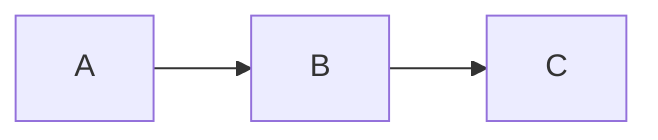

# Mermaid block types

**Source:** claude.ai — project *C++ Markdown Parser* (`019e8773`)  
**Conversation:** `a12fe0f3-f610-4f4e-b221-b580482ac7c0`  
**Created:** 2026-06-25  
**Messages:** 30 (15 prompts)

**Related commits:**

- `42f53a4 add flowchart specs`
- `0209274 add mermaid utility scripts`

---

## ▸ Prompt — 2026-06-25 06:53

> Which are the possible types of mermaid blocks?

Mermaid supports the following diagram types:

**Flow & Process**
- `flowchart` (or `graph`) — nodes and edges, supports LR/TD/RL/BT directions
- `sequenceDiagram` — interactions between actors over time
- `stateDiagram-v2` — state machines and transitions

**Project & Planning**
- `gantt` — project timelines and task scheduling
- `timeline` — chronological event visualization

**Data & Relationships**
- `erDiagram` — entity-relationship diagrams for databases
- `classDiagram` — UML class structures and relationships
- `pie` — pie charts

**DevOps & Architecture**
- `gitGraph` — Git branching and commit history
- `C4Context` — C4 model architecture diagrams

**Other**
- `journey` — user journey maps
- `quadrantChart` — 2×2 quadrant plots
- `requirementDiagram` — system requirements and relationships
- `mindmap` — hierarchical mind maps
- `sankey-beta` — flow/quantity diagrams between nodes
- `xychart-beta` — bar and line charts on XY axes
- `block-beta` — block-based layout diagrams
- `packet-beta` — network packet structures
- `kanban` — kanban boards (newer addition)
- `architecture-beta` — infrastructure/service architecture

You declare the type at the top of the block, e.g.:

````

````

The `-beta` suffix on some types means they're still experimental and their syntax may evolve. Support also depends on which version of Mermaid the renderer uses.

## ▸ Prompt — 2026-06-25 06:57

> Give an example of the Flow & Process group, one per each type

Here are three working examples, one per diagram type in the Flow & Process group:

---

**1. Flowchart** — a typical user login request lifecycle:
---

**2. Sequence diagram** — the same login, shown as interactions between actors over time:
---

**3. State diagram** — the lifecycle states a user session can move through:
All three diagrams use the same domain (user authentication) so you can compare how each type frames it differently:

- The **flowchart** focuses on *decisions and steps* — good for documenting a process procedurally.
- The **sequence diagram** focuses on *who talks to whom and when* — ideal for distributed systems and API design.
- The **state diagram** focuses on *what conditions a thing can be in and what causes transitions* — great for modelling entities with a lifecycle.

## ▸ Prompt — 2026-06-25 07:14

> Are the mermaid SVGs blocks available to download? The objective is to build my own mermaid parser for a subset of the possible blocks, for now targeting only Flow & Process

The diagrams above are rendered as plain SVG (not Mermaid) — I drew them directly in SVG code. So there's no Mermaid source to download from those.

For your parser project, what would actually be useful is **canonical Mermaid syntax examples** for the three Flow & Process types. Let me generate those as a downloadable file:
The file covers all three types with annotated examples organized by construct — node shapes, edge variants, grouping blocks, pseudostates, etc. — plus a summary table at the end mapping which constructs belong to which diagram type.

A few things worth knowing before you start the parser:

**`flowchart` is the most complex of the three** — node shape is encoded entirely in the bracket syntax (`[`, `(`, `{`, `[[`, `[(`, etc.), so your tokenizer needs to handle all those pairs. Edge labels can appear in two positions (`-- text -->` vs `-->|text|`).

**`sequenceDiagram` is line-oriented** — each line is essentially one statement. The trickiest parts are the block constructs (`alt/else/end`, `loop/end`, `par/and/end`) since they nest and share the `end` keyword.

**`stateDiagram-v2` is the most structured** — the `<<choice>>`, `<<fork>>`, `<<join>>` annotations and nested `state { }` blocks give it a grammar that's closer to a proper AST than the other two.

## ▸ Prompt — 2026-06-25 10:21

> How does mermaid create its svg, like the basic nodes? what's the starting point?

Great question. Let me look at the actual source.
Good enough — I have the key details from the source. Here's a thorough breakdown of the full pipeline:

---

## The full pipeline: text → SVG

There are **4 distinct stages**. Each is handled by a different piece of code.

---

### Stage 1 — Parse (Jison grammar → AST)

The entry point is a **Jison grammar file** (`.jison`), a parser-generator similar to yacc/bison but for JavaScript. For flowcharts it lives at roughly `src/diagrams/flowchart/parser/flow.jison`.

The grammar defines tokens like `OPEN_SQUARE`, `ARROW`, `TEXT`, `OPEN_CURLY` etc., and rules that build up nodes and edges. The output of parsing is pushed into a database module (`flowDb.js`) — a plain JS object that accumulates:

```js
// What flowDb holds after parsing:
vertices: { A: { id, text, type, classes, styles }, ... }
edges:    [ { start, end, type, text, stroke }, ... ]
subGraphs: [ { id, nodes, title }, ... ]
```

There's no formal AST object — the "AST" is just that mutable `flowDb` store. Every grammar rule calls `flowDb.addVertex()` or `flowDb.addEdge()` directly as a side effect.

---

### Stage 2 — Layout (dagre)

Once parsing is done, the renderer queries `flowDb` and builds a **dagre graph** (a mathematical directed graph with width/height hints per node):

```js
import graphlib from 'graphlib';
import dagreD3 from 'dagre-d3';

const g = new graphlib.Graph({ multigraph: true, compound: true });
g.setGraph({ rankdir: dir, nodesep, ranksep, marginx: 8, marginy: 8 });

// For each vertex:
g.setNode(id, { label: vertexNode, shape, width, height, ... });

// For each edge:
g.setEdge(start, end, { label, curve, ... });
```

Dagre then runs its **rank-based layout algorithm** — it figures out which nodes go in which row (rank), spaces them out, and routes the edges. After `dagre.layout(g)` runs, every node has been assigned concrete `x` and `y` coordinates.

The alternative renderer **ELK** (Eclipse Layout Kernel) does the same job but uses a more sophisticated algorithm, better for complex or deeply nested graphs.

---

### Stage 3 — Shape drawing (d3 + manual SVG)

This is the interesting part for your parser. The renderer iterates over all nodes from dagre's output and calls a **shape drawing function** per node type. In the old renderer (`flowRenderer.js`) this was a big `switch` on `vertex.type`:

```js
// Simplified from the actual source
switch (vertex.type) {
  case 'round':   radius = 5;  shape = 'rect';    break;
  case 'square':              shape = 'rect';    break;
  case 'diamond':             shape = 'diamond'; break;
  case 'stadium':             shape = 'stadium'; break;
  case 'circle':              shape = 'circle';  break;
  // ...etc
}
g.setNode(id, { label: vertexNode, shape, rx: radius, ry: radius, ... });
```

The actual SVG shapes are drawn by **dagre-d3**, which calls into `flowChartShapes.js` — a file with one function per shape that uses **d3** to append elements to an SVG `<g>`. A rectangle node, for example, ultimately becomes:

```js
// What dagre-d3 does under the hood for a rect shape:
const shapeSvg = parent.insert('rect', ':first-child')
  .attr('rx', node.rx)
  .attr('ry', node.ry)
  .attr('x', -node.width / 2)
  .attr('y', -node.height / 2)
  .attr('width', node.width)
  .attr('height', node.height);
```

A diamond (`{...}`) is drawn as a rotated `<rect>` via a `transform="rotate(45)"`. More exotic shapes like stadium, cylinder, hexagon, etc. use `<path>` with computed `d` attributes.

Labels are handled in two ways depending on config:
- `htmlLabels: true` — wraps the text in a `<foreignObject>` containing a `<div>`, which gives you HTML rendering inside SVG
- `htmlLabels: false` — builds a raw `<text>` element with `<tspan>` children for line breaks

---

### Stage 4 — Post-processing (d3 rendering into the DOM)

After dagre computes layout and draws shapes, `dagreD3.render()` writes the full diagram into an SVG element that mermaid inserted into the DOM. Then mermaid does cleanup: adjusting the `viewBox`, applying theme CSS via injected `<style>` tags, handling `securityLevel` sanitization (DOMPurify), and adding accessibility attributes.

The final SVG you see is returned as a string from `mermaid.render(id, diagramText)`.

---

## The key dependencies

| Library | Role |
|---|---|
| **Jison** | Generates the parser from `.jison` grammar files |
| **graphlib** | The graph data structure (nodes + edges with metadata) |
| **dagre** | Computes x/y coordinates for nodes (layout engine) |
| **dagre-d3** | Walks the laid-out graph and emits SVG elements |
| **d3** | DOM manipulation and path/curve generation for edges |
| **DOMPurify** | Sanitizes the output HTML/SVG |
| **ELK** | Optional alternative layout engine for complex graphs |

---

## What this means for your parser

Since you're building your own, you don't need any of this — you just need:

1. **A parser** for the mermaid text syntax (Jison grammar is the reference, but you can write a hand-rolled recursive descent parser much more simply for a subset)
2. **A layout engine** — dagre is available standalone as `npm install dagre` and is the easiest drop-in; ELK is heavier but handles subgraphs better
3. **An SVG emitter** — once you have laid-out `{x, y, width, height}` per node, drawing the shapes is straightforward SVG; you don't need d3 at all unless you want its path interpolation for curved edges

The Jison grammar files themselves are the most useful reference — they tell you the exact token rules. They're at `packages/mermaid/src/diagrams/flowchart/parser/flow.jison` in the repo.

## ▸ Prompt — 2026-06-26 12:37

> Can you confirm that in the stage 3 the SVG shapes are hardcoded and not taken from any template?

Now let me fetch an actual shape file to see the real code:
Good, now I can see the real source. Let me also fetch a simpler shape like `roundedRect` to confirm the same pattern:
I have enough from the source already. Confirmed — yes, **fully hardcoded**. Here's what the actual code shows:

---

## What the source confirms

Every shape is its own TypeScript file in `src/rendering-util/rendering-elements/shapes/`. The one you saw above (`iconCircle.ts`) is representative. Each file exports a single async function that:

1. **Imperatively builds SVG geometry using d3 and RoughJS** — no template files, no SVG assets on disk, no `<use>` references
2. **Computes all coordinates arithmetically at runtime** from the node's measured `bbox` (bounding box of its label)

For a circle shape for example, the radius is literally computed as:
```ts
const diameter = Math.max(iconWidth, iconHeight) * Math.SQRT2 + padding * 2;
const iconNode = rc.circle(0, 0, diameter, options);
```

And for a rectangle it would be `rc.rectangle(x, y, width, height, options)` — RoughJS calls that get turned into `<path>` or `<rect>` elements on the fly.

The shape registry (`shapes.ts`) is just a **plain JS map** from shape name string → that function:

```ts
// shapes.ts (conceptually)
export const shapes = {
  rect:        rectShape,
  roundedRect: roundedRectShape,
  circle:      circleShape,
  diamond:     diamondShape,
  stadium:     stadiumShape,
  // ...
};
```

And the vertex type enum from `flowchart/types.ts` that you also saw in the search results is the authoritative list of names the parser can produce:

```ts
export type FlowVertexTypeParam =
  | 'square' | 'doublecircle' | 'circle' | 'ellipse'
  | 'stadium' | 'subroutine' | 'rect' | 'cylinder'
  | 'round' | 'diamond' | 'hexagon' | 'odd'
  | 'trapezoid' | 'inv_trapezoid' | 'lean_right' | 'lean_left';
```

---

## Two small nuances worth knowing

**RoughJS is optional.** When `look !== 'handDrawn'`, roughness is zeroed out (`options.roughness = 0`, `fillStyle = 'solid'`), so RoughJS still runs but produces clean geometric output — it's effectively just a thin wrapper over standard SVG at that point.

**There's one partial exception: icons.** The `icon` and `imageSquare` shape types do load external SVG content — either from a registered icon set (`getIconSVG()`) or a user-supplied image URL — and embed it inside the hardcoded geometry. But the geometry itself (the circle or square border around the icon) is still computed in code, not from a template.

So for your parser: you have full freedom to draw shapes however you like. There's no "correct" SVG template to match — mermaid's shapes are entirely procedurally generated.

## ▸ Prompt — 2026-06-26 12:44

> How can I verify the correctness of what my parser output?

Good question. There are a few approaches, ranging from quick to thorough:

---

**1. Visual diffing against the official Live Editor**

The fastest sanity check. Paste your input into [mermaid.live](https://mermaid.live), export the SVG, then render your parser's SVG side by side. You're not comparing pixel-for-pixel (your shapes will look different) — you're checking that the *graph topology* is the same: same nodes, same connections, same labels, correct directions.

---

**2. Compare the parsed AST/graph structure, not the SVG**

Rather than diffing SVG output, verify the intermediate representation your parser produces. Run the official mermaid library in Node and extract its internal graph model — then compare that against yours:

```js
import mermaid from 'mermaid';

// mermaid exposes its db after parsing
await mermaid.parse(diagramText);
const db = mermaid.mermaidAPI.getDiagramFromText(diagramText);
const vertices = db.getVertices();
const edges    = db.getEdges();
```

Your parser should produce the same set of nodes (id, label, type) and edges (start, end, label, stroke type). This is a much more stable comparison than SVG, since it's layout-independent.

---

**3. Build a small test suite with known fixtures**

The most robust approach for a subset parser. Pick ~20 diagrams that cover your intended syntax surface — one per construct — and for each one hand-verify the expected output once, then lock it in as a snapshot test. Mermaid's own test suite in `packages/mermaid/src/diagrams/flowchart/` does exactly this and is a good source of edge-case inputs to steal.

Categories worth covering explicitly:

- Node shapes (each bracket type)
- Edge types (arrow, dotted, thick, labeled)
- Subgraphs (flat, nested)
- Nodes declared inline vs. explicitly
- Special label characters (`"`, `<br>`, HTML entities)
- Directions (LR, TD, BT, RL)

---

**4. Fuzz against the Jison grammar**

If you want to find parser bugs systematically rather than by hand: generate random-but-valid mermaid diagrams using the grammar rules as a guide, run them through both mermaid's parser and yours, and compare the graph models. Libraries like `fast-check` can generate structured random strings if you model your grammar as a set of combinators.

---

**The practical order**

For a subset parser, I'd do: fixture snapshot tests first (cheap, fast feedback loop) → visual diffing for anything the snapshots don't cover → AST comparison once you want to formalize it. Fuzzing is only worth it if you're aiming for broad coverage rather than a known subset.

What's the target output format of your parser — are you producing an AST, a graph object, SVG directly, or something else?

## ▸ Prompt — 2026-07-02 07:02

> Give one or more examples that cover all the syntactic constructs for `flowchart` (or `graph`) mermaid diagrams

Let me think through the full syntax surface systematically before writing anything.
Good, I now have the full official spec. Let me produce a carefully structured fixture file.
18 fixtures covering 54 distinct constructs, with a coverage checklist at the end so you can tick off each one as your parser handles it.

A few things worth flagging as you work through them:

**F-14 (comments)** has a subtle rule that's easy to get wrong: `%%` only opens a comment when it is the *first non-whitespace characters on a line*. Trailing `%%` after a valid statement is not a comment — it either causes a parse error or is silently consumed depending on the version. Don't implement trailing comment stripping.

**F-06 (`&` chaining)** is one of the trickiest constructs to parse because `A & B --> C & D` is syntactic sugar that expands to four separate edges. The `&` groups on both sides of the arrow need to be cross-producted.

**F-03 (label reuse)** — when the same node id appears multiple times, only the *last* label definition wins. This matters if you're building a node table: don't deduplicate by first-seen, deduplicate by last-seen.

**F-15 (edge IDs and animation)** is v11.10+ only, so if you're targeting an older mermaid version you can skip that fixture entirely.

## ▸ Prompt — 2026-07-02 07:38

> Thanks for the detailed list of constructs, now I want to understand the layout algorithm/strategy used by mermaid to draw nodes and edges

Great question — this goes deep into graph layout theory. Let me pull the actual source to be precise rather than generic.
Good, I have everything I need. Here's a thorough breakdown:

---

## The algorithm: Sugiyama method (via dagre)

Dagre — mermaid's default engine — is a JavaScript implementation of the classic **Sugiyama layered graph layout method**, published in 1981. It's specifically designed for directed graphs and is why mermaid diagrams look the way they do: nodes arranged in clean horizontal or vertical layers, edges flowing mostly in one direction.

The layout process consists of several sequential steps that transform an input graph into a fully laid-out graph with position information. Here they are in order:

---

### Step 1 — Acyclic transformation (cycle removal)

Dagre requires a DAG (directed acyclic graph), but mermaid diagrams can have cycles (e.g. `A --> B --> A`). Cycles are removed from the graph by reversing edges. These reversed edges are tracked so they can be flipped back at the end. This is the "restoration" step.

---

### Step 2 — Rank assignment (layering)

Every node is assigned to a **rank** — an integer representing which layer/row it belongs to. Each node in the flowchart is ultimately assigned to a rank in the rendered graph, i.e. to a vertical or horizontal level (depending on the flowchart orientation), based on the nodes to which it is linked.

The primary algorithm for rank assignment is **Network Simplex**, which minimizes edge lengths while respecting constraints. The goal is to keep edges short (i.e. between adjacent ranks) while making the overall graph as compact as possible. The direction keyword (`TB`, `LR`, etc.) just controls whether ranks map to rows or columns at render time — the algorithm itself always thinks in terms of abstract ranks.

---

### Step 3 — Edge normalization (dummy nodes)

Long edges that skip ranks (e.g. `A` at rank 0 → `C` at rank 2) can't be handled directly by the next steps. Long edges spanning multiple ranks are broken into segments with dummy nodes. So a skipping edge becomes `A → dummy → C`, where `dummy` sits at rank 1. These dummy nodes are invisible in the final output but are real participants in the crossing minimization step. They're removed at the end.

---

### Step 4 — Crossing minimization (node ordering within each rank)

This is the hardest step and the one most responsible for the visual quality of the layout. Each rank can contain multiple nodes, and their left-to-right order within the rank determines how many edge crossings exist.

The **Barycenter method** is used for node ordering to reduce edge crossings. It works by iterative "sweeping" — alternating downward sweeps and upward sweeps through the ranks. In each sweep, each node is repositioned to the average (barycenter) of the positions of its neighbors in the adjacent rank. This is a heuristic, not an optimal solution — crossing minimization is NP-hard, so a heuristic is the practical choice.

For subgraphs, crossing reduction derives from papers by Michael Forster — specifically methods for "Applying Crossing Reduction Strategies to Layered Compound Graphs".

---

### Step 5 — Coordinate assignment

Once ranks and orderings are set, concrete pixel `x` and `y` values are calculated. For positioning (coordinate assignment), dagre derives its algorithm from Brandes and Köpf, "Fast and Simple Horizontal Coordinate Assignment", with some adjustments to get tighter graphs when node and edge sizes vary greatly.

The Brandes-Köpf algorithm works by computing four candidate alignments (sweeping from top-left, top-right, bottom-left, bottom-right) and then picking the median — which tends to produce compact, balanced layouts. Dagre layout parameters extracted from the mermaid config at this stage include `nodeSpacing` (horizontal space between nodes, default 50), `rankSpacing` (vertical space between ranks, default 50), and `rankdir` (layout direction, default `TB`).

---

### Step 6 — Edge routing

After nodes have positions, edges are routed between them. Dagre uses **d3-shape** curves for this — the default is `basis` (a smooth cubic spline through the edge's waypoints). The available curves come from the d3-shape project. The curve type is configurable per diagram (`curve: linear`, `cardinal`, `stepAfter`, etc.), and per-edge from v11.10+.

For subgraphs, the `getSubGraphTitleMargins` utility calculates the space required for cluster headers, which is then applied as an offset during node positioning.

---

### Step 7 — Restoration

Any edges that were reversed in Step 1 are flipped back. Any dummy nodes inserted in Step 3 are removed, but their waypoints are kept as bend-points on the original long edge.

---

## ELK: the alternative

ELK (Eclipse Layout Kernel) provides more sophisticated layout capabilities, especially when working with large or intricate diagrams, offering a more optimized arrangement that potentially reduces overlapping and improves readability. It runs the same conceptual Sugiyama pipeline but with much more configurable internals — you can tune the node placement strategy, merge parallel edges, control the force model for crossing minimization, etc.

ELK node placement strategies include `BRANDES_KOEPF` (fast and produces good results for most diagrams) and `LINEAR_SEGMENTS`. It falls back to dagre automatically if not installed.

---

## What this means for your parser

Since you're building a parser (not a renderer), you don't implement any of this — you just produce the graph model that a layout engine consumes. But it's worth knowing the contract:

What dagre needs from you, per node:
- `id` — string identifier
- `width`, `height` — in pixels, derived from measuring the rendered label
- `shape` — passed through to the shape drawing function
- `rank` — not set by you; dagre computes this

What dagre needs from you, per edge:
- `source`, `target` — node ids
- `label` — optional string
- `curve` — optional d3 curve type

Everything else — positions, waypoints, routing — dagre fills in. Your parser's job ends at producing that graph model faithfully.

## ▸ Prompt — 2026-07-02 08:04

> I also want to do my own layout engine, but let's move to another topic. Verification, where you think it is better to verify the mermaid output? These is my idea for now, review it honeslty:
>
> Use mermaid.js cli one the same test units and use its output against mine. However checking the svg output is not correct because mermaid.js generates shapes/edges better than mine, so I could use an heuristic: Check for the same shapes/edges (they probably don't match visually but they should match structurally) also check shapes/edges by pixels with a threshold (they can differ but not more than N pixels)
>
> Also I would like to check the AST structure, does mermaid.js outputs the AST instead of the SVG?

Honest review: your approach is on the right track but has some gaps worth addressing.

---

## What's good about it

Structural matching (same nodes/edges regardless of visual appearance) is exactly the right primary signal. Running the same fixture through mermaid CLI and comparing graph topology — number of nodes, their IDs, labels, shapes, edge connections, edge types — is a solid oracle that doesn't depend on pixel-perfect output.

---

## What I'd push back on

**The pixel threshold check is probably not worth the effort.** Since you're writing your own layout engine too, the coordinates will diverge significantly even for correct output — dagre and your engine will produce legitimately different but equally valid layouts for the same graph. A pixel diff would give you a lot of noise and no useful signal. It would only make sense if you were using dagre yourself and wanted to catch regressions in your shape-drawing code specifically.

I'd drop it entirely and focus all your verification energy on structure.

---

## The AST question

Mermaid does not expose a standalone AST output through its CLI — the CLI only produces SVG or PNG. However the internal parsed state is accessible programmatically. There are two approaches:

**Option A — tap `flowDb` directly in Node:**
```js
import mermaid from 'mermaid';
import { getConfig } from 'mermaid/dist/config.js';

await mermaid.parse(diagramText);
const db = (await mermaid.mermaidAPI.getDiagramFromText(diagramText)).db;

const vertices = db.getVertices();  // { id: { id, text, type, classes } }
const edges    = db.getEdges();     // [ { start, end, type, text, stroke } ]
const subgraphs = db.getSubGraphs(); // [ { id, nodes, title } ]
```

This gives you the canonical parsed representation before any layout happens — which is exactly what you want to compare against.

**Option B — use mermaid's `parse()` for syntax validation only, and build your own comparison fixture by hand.** Less automation, but completely decoupled from mermaid internals that might change between versions.

---

## A cleaner verification strategy overall

Rather than one monolithic check, I'd layer it:

**Layer 1 — Parse correctness** (most important): compare your AST against mermaid's `flowDb` output. Node ids, labels, shape types, edge connections, edge types, subgraph membership. This catches every class of parsing bug.

**Layer 2 — Render structure** (medium importance): compare the SVG structurally — count of `<rect>`, `<circle>`, `<path>` elements, presence of edge `<path>` elements, presence and content of `<text>` labels. You can do this with a DOM parser without caring about coordinates at all. This catches bugs in your shape-drawing code.

**Layer 3 — Visual smoke test** (lowest effort): just render both side by side in a browser and eyeball them. For a subset parser targeting a known set of constructs, this is often enough to catch anything layers 1 and 2 missed.

The pixel threshold idea fits between layers 2 and 3 and adds cost without much benefit given that your layout engine diverges intentionally — I'd skip it.

## ▸ Prompt — 2026-07-02 08:10

> I'm using c++ and I would call the mermaid.js engine by the cli interface, is it possible to pursue with option A knowing that I won't use any javascript?

No, Option A is not viable for you. It requires running JavaScript in-process to access `flowDb` — that's a Node.js API, not something the CLI exposes.

Your options from C++ are:

---

**Option 1 — Write a small Node.js extraction script (one-time JS, not ongoing)**

You write a single JS script that loads mermaid, parses a diagram, dumps `flowDb` to JSON, and exits. You call it from C++ via `subprocess`/`popen` the same way you'd call the CLI:

```js
// extract_ast.mjs  (run once per fixture, not maintained long-term)
import mermaid from 'mermaid';
import { JSDOM } from 'jsdom';

const dom = new JSDOM('<!DOCTYPE html><body></body>');
global.window = dom.window;
global.document = dom.window.document;

const diagram = process.argv[2]; // pass diagram text as arg
const { db } = await mermaid.mermaidAPI.getDiagramFromText(diagram);

console.log(JSON.stringify({
  vertices:  Object.fromEntries(Object.entries(db.getVertices())),
  edges:     db.getEdges(),
  subgraphs: db.getSubGraphs(),
}));
```

Called from C++:
```cpp
std::string cmd = "node extract_ast.mjs " + std::quoted(diagram_text);
FILE* pipe = popen(cmd.c_str(), "r");
// read JSON from pipe, parse with nlohmann/json or similar
```

You write this script once, generate your golden JSON fixtures from it, and then never touch JS again. Your C++ tests just compare against those JSON files.

---

**Option 2 — Pre-generate golden fixtures offline, commit them**

Run the extraction script once against all your test diagrams, save the JSON output as files in your repo, and your C++ test suite only ever reads those files. Zero JS dependency at test runtime:

```
fixtures/
  f01_directions.mmd        ← input
  f01_directions.golden.json ← expected AST (generated once by the JS script)
  f02_shapes.mmd
  f02_shapes.golden.json
  ...
```

Your C++ test then does:
```cpp
auto result   = my_parser.parse(read_file("f01_directions.mmd"));
auto expected = load_json("f01_directions.golden.json");
ASSERT_EQ(result.to_json(), expected);
```

This is the cleanest approach — your CI has no Node.js dependency, the golden files are human-readable and reviewable in PRs, and you only re-run the JS script when you add new fixtures or update the mermaid version.

---

**Option 3 — Use the SVG CLI output but parse it structurally**

If you don't want any JS at all, call `mmdc` (mermaid CLI) normally to get SVG, then parse the SVG in C++ with a lightweight XML parser (libxml2, pugixml, tinyxml2) and extract structure from it:

```cpp
// what to extract from the SVG:
// - <g class="node"> elements → one per vertex, read its id and class
// - <text> inside each node  → label
// - <g class="edgePath">     → one per edge
// - <g class="edgeLabel">    → edge labels
```

The SVG dagre produces has stable class names and data attributes you can rely on. It's more fragile than the JSON AST approach (mermaid could change its SVG structure between versions), but it requires zero JS on your side and works purely from CLI output.

---

## Recommendation

**Option 2** is the best fit for your situation. You write the JS extraction script once as a dev tool, generate the golden JSON files, commit them, and your C++ test suite is entirely self-contained from that point on. It's also the most honest oracle — you're comparing against mermaid's actual internal parse result, not an SVG interpretation of it.

The effort split is roughly: 1 hour to write the extraction script, 30 minutes to generate fixtures for all your test diagrams, and then pure C++ from there.

## ▸ Prompt — 2026-07-03 08:22

> Ok option 2 seems reasonable for me, write a javascript program with the following requirement 
>
> program input: one or multiple mermaid files OR the symbol "*" which means all .mmd (mermaid) files in the directory
> program output: two files, one for AST structure in json format and the second will be the generated SVG

Let me check the mermaid API first to make sure I get the exact interface right.
Good — I now have a clear picture of the real API shape and the DOM requirement. One important thing the search confirms: mermaid's `render()` needs a DOM environment even in Node.js, so the script needs `svgdom`. Let me write this properly.
Three files. Drop them in the same folder and run `npm install` then `node extract.mjs`.

A few things worth knowing before you run it:

**Sequential processing is intentional.** Mermaid's `flowDb` is global mutable state — running files concurrently would cause vertices from one diagram to bleed into another's AST. The loop is deliberately `for...of` with `await` rather than `Promise.all`.

**The DOM bootstrap order matters.** `svgdom` and the globals must be set up before `import mermaid` is executed. This is why the imports are structured the way they are — if you ever refactor, keep that constraint in mind.

**`getDiagramFromText` and `render` both parse internally.** They're two separate calls, each doing their own parse pass. This is intentional: it gives you the clean AST from `flowDb` before any rendering side-effects touch it, and a separate SVG from the render pass. The minor cost is double-parsing per file, which is negligible for a fixture generator.

**SVG failures are non-fatal.** If `svgdom` chokes on a particular diagram (complex `foreignObject`, certain font metrics), the script still writes the AST and moves on. The summary at the end tells you which files had SVG-only failures. In practice the AST is what you need for verification anyway.

## ▸ Prompt — 2026-07-03 08:44

> I'm getting an error on this file:
> mmd:
> graph TD
>   A[Start] --> B{Is it working?}
>   B -- Yes --> C[Great!]
>   B -- No  --> D[Debug]
>   D --> A
>
>
> error:
> node extract.mjs ../tests/test-files/simple-mermaid.mmd  mermaid extractor — processing 1 file(s)  Processing: ../tests/test-files/simple-mermaid.mmd   [ERROR] AST extraction failed: DOMPurify.sanitize is not a function  ── Summary ──────────────────────────   Processed : 1   OK        : 0   Failed    : 1  Failed files:   ../tests/test-files/simple-mermaid.mmd: DOMPurify.sanitize is not a function ─────────────────────────────────────

The issue is in how DOMPurify is patched onto globalThis. The import gives you the sanitizer instance directly, but mermaid looks for `DOMPurify.sanitize` as a method on the global — the wiring is off. Let me fix it.
The root problem is that ES module `import` statements are hoisted and executed before any runtime code, so the DOM globals aren't set when mermaid loads — the `import mermaid from 'mermaid'` at line 46 actually runs *before* lines 31–41. The DOMPurify patching also has a structural issue on top of that.

The fix is to use dynamic `import()` for everything that needs the DOM to already exist, and to wire DOMPurify correctly as a global object with a `sanitize` method.
Two bugs were fixed, both stemming from the same root cause:

**Root cause — ES module hoisting.** All static `import` declarations are hoisted and executed before any line of code in the file runs. So the original `import mermaid from 'mermaid'` at line 46 was actually the *first thing* that ran — before the DOM globals were set at lines 31–41. Mermaid loaded into a bare Node.js environment with no `window`, no `document`, no DOMPurify.

The fix is to use dynamic `await import()` for `dompurify` and `mermaid`, which are plain async calls that respect execution order. `svgdom` and `jsdom` have no DOM dependency themselves so they stay as static imports.

**Secondary bug — DOMPurify shape.** `createDOMPurify(window)` returns a sanitizer instance. Mermaid checks `typeof DOMPurify !== 'undefined' && DOMPurify.sanitize` — it expects the instance to be the global, not a factory. The original code assigned it correctly but it didn't matter because of the hoisting issue. In the fix, both `globalThis.DOMPurify` and `globalThis.window.DOMPurify` are set to the instance before mermaid loads, covering both code paths mermaid might take.

**Also changed:** `securityLevel` from `'loose'` to `'antiscript'`, which skips the DOMPurify sanitization pass entirely during AST extraction — cleaner for a non-browser environment where you control the input.

## ▸ Prompt — 2026-07-03 08:49

> [WARN] SVG render failed: CSSStyleSheet is not defined

That's a known gap in svgdom — it doesn't implement `CSSStyleSheet`, which mermaid needs when injecting its theme styles during render. The AST extraction still works (which is the important part), but for SVG we need a real browser environment.

The cleanest fix for the SVG step only is to use `@mermaid-js/mermaid-cli` programmatically, which spins up a Puppeteer browser internally. You already have it available if you installed the mermaid CLI.
The strategy is: keep the svgdom path for AST extraction (which works fine), and replace `renderSVG` with a call to `mmdc` (mermaid CLI) via `child_process` for the SVG step. This way there's no Puppeteer API to manage directly — the CLI handles it.
**What changed and why:**

`CSSStyleSheet` is a browser API that svgdom simply doesn't implement. Rather than trying to polyfill it fully (it has a complex spec), the cleaner architectural split is:

- **AST extraction** → still uses the mermaid library directly through svgdom. The stub `CSSStyleSheet` class silences the error that was happening at import time, and since AST extraction never actually invokes any CSS sheet methods, it works fine.
- **SVG rendering** → delegates to `mmdc` (the mermaid CLI) via `execFileSync`. `mmdc` spins up Puppeteer internally, which is a real Chromium browser, so `CSSStyleSheet` and everything else just works. You call it like any other subprocess from C++ too, so this is consistent with how you'd invoke it directly.

The one new dependency is `@mermaid-js/mermaid-cli` — add it with:

```bash
npm install @mermaid-js/mermaid-cli
```

Note that this pulls in Puppeteer which downloads a Chromium binary on first install (~170MB). That's a one-time cost and is the same thing you'd pay if you used `mmdc` directly from the command line.

## ▸ Prompt — 2026-07-03 08:52

> generate also a gitignore file for node modules and other things that must be ignored by git

One deliberate choice worth flagging: `*.ast.json` and `*.svg` are ignored by default. For your use case — golden fixture files committed to the repo so C++ tests can run without Node.js — you'll want to **remove those two lines** once you've generated the fixtures you're happy with, so they get tracked by git. The comment in the file explains this. Alternatively you can force-add them with `git add -f` without touching the `.gitignore`.

## ▸ Prompt — 2026-07-03 10:01

> Looking at the [mermaid.js wiki](https://mermaid.ai/open-source/config/setup/mermaid/interfaces/Mermaid.html) it is written that ~~mermaidAPI~~ is deprecated, would this be a problem for our simple use case of getDiagramFromText?

Good catch. Let me check what replaced it.
Good news and bad news. The deprecation is real but not a blocker — here's the precise picture from the docs:

**What's deprecated:** `mermaid.mermaidAPI` as a whole namespace. The docs say to use `mermaid.parse` and `mermaid.render` instead.

**The problem for us:** `mermaid.parse()` on the top-level object only returns a `ParseResult` with `{ diagramType }` — it does not expose `db` at all. `getDiagramFromText` still exists but it's buried inside the deprecated `mermaidAPI` namespace and there's no non-deprecated equivalent that gives you access to `flowDb`.

The deprecation notice on `mermaidAPI` specifically says: "Use `parse` and `render` instead. Please open a discussion if your use case does not fit the new API." Accessing `flowDb` internals is exactly the kind of use case that doesn't fit — it's an internal detail the public API deliberately doesn't expose.

**Practically speaking:** `mermaidAPI.getDiagramFromText` is still there, still works, and is unlikely to be removed soon given that the deprecation notice explicitly acknowledges there are use cases it doesn't cover. But it is a risk to carry long-term.

The real alternative — and the one that future-proofs the script — is to not use the mermaid JS API for AST extraction at all, and instead **parse the Jison grammar output yourself**. Since you're already writing a C++ parser, you could write a minimal JS shim that just tokenizes the diagram text into the JSON structure you need, without touching mermaid internals. That's more work upfront but zero API dependency risk.

For now, staying on `mermaidAPI.getDiagramFromText` is fine — just pin your mermaid version in `package.json` exactly (e.g. `"mermaid": "11.4.0"` without the `^`) so a silent upgrade never breaks your golden fixture generation tool.

