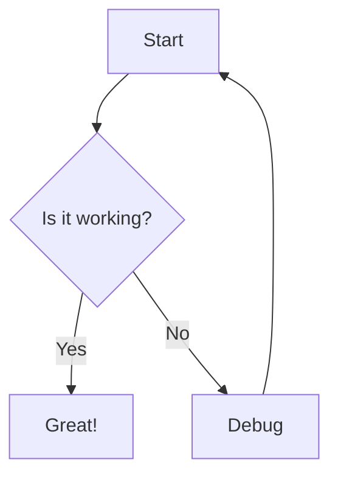

# Welcome to Markdown Parser

Type on the left see the result on the right.

## Features

- **Bold** and _italic_ text
- `inline code` and fenced code blocks
- [Links](https://example.com)
- Blockquotes lists and more

```js
console.log("Hello world!");
```

## Mermaid Diagram


